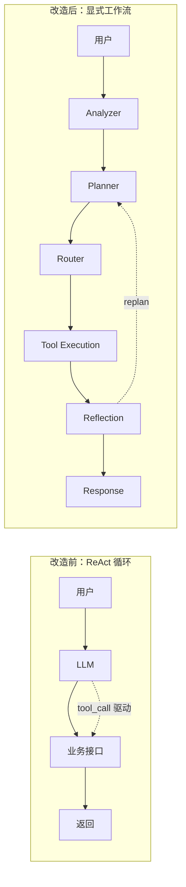
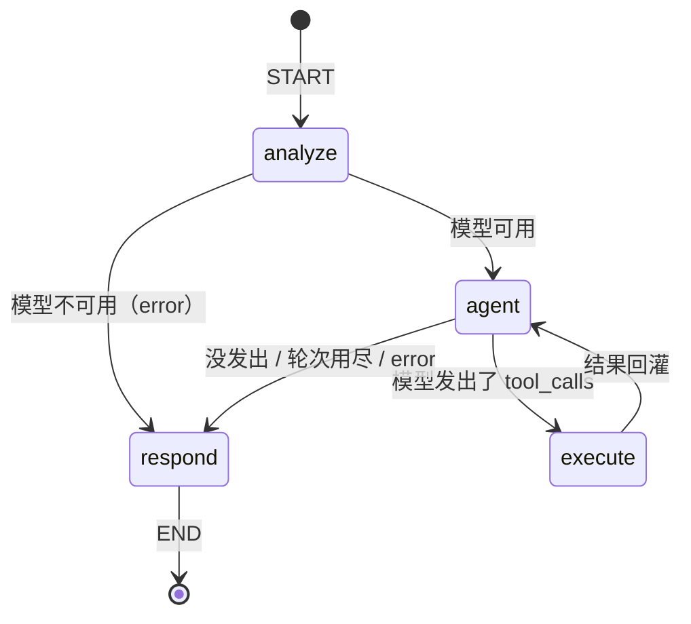
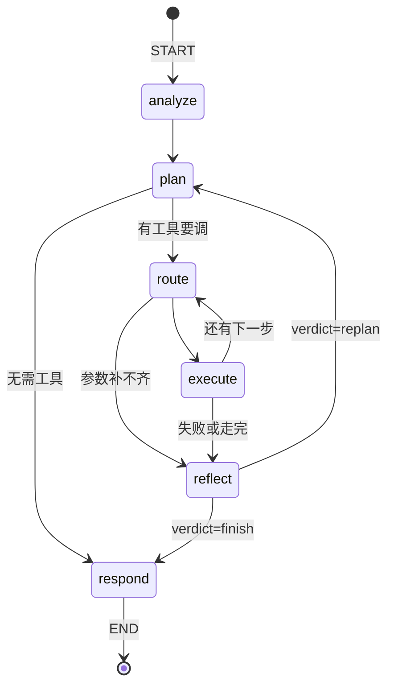
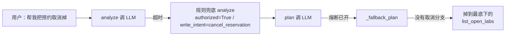
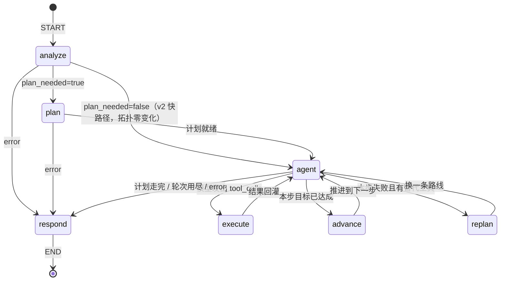
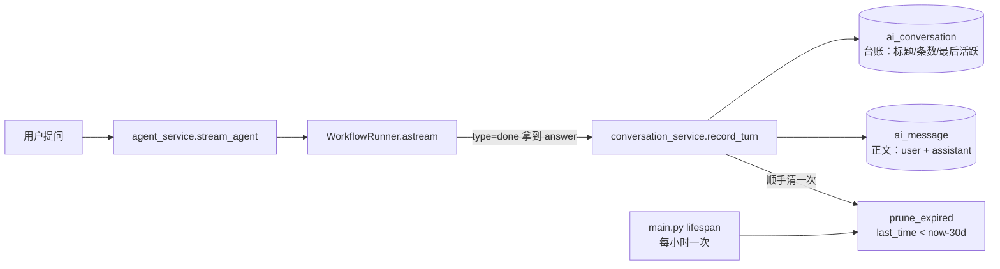

# Agent Workflow 架构说明

> 把实验室预约系统从「LLM + CRUD」改造成一条**可控的 Agent 工作流**。
> 本文记录架构决策、契约、以及踩过的坑 —— 尤其是那些「看起来在正常工作、
> 实际上核心能力已经失效」的静默故障。
>
> **当前实现是 v3**：在 v2（native tool calling，§3）之上加了一层**条件触发**
> 的 Plan-and-Execute 规划层，见 §14。§3-旧 / §4-旧 以及 §7 里带 v1 标记的小节
> 描述的是已经被删除的显式工作流，保留下来只为解释「当初为什么那么做、后来
> 为什么改回来」。标记为「仍然成立」的结论不受各次改造影响。
>
> **工具定义层已升级到 LangChain 标准 `@tool`**（见 §5）。v2 刚落地时工具还是
> 手写的 JSON Schema dict，现在换成 `@tool` + 类型注解 + `Field(description=...)`；
> 执行链路（`run_tool` / `bind_tools` / 图拓扑 / SSE 契约）**全部没变**。
>
> **用户可见的聊天记录已改为落库留存 30 天**（`ai_conversation` /
> `ai_message`，可列出、可回看、可续聊），见 §15。

---

## 1. 为什么要改造

改造前的形态是典型的 `用户 → LLM 理解 → 调后端接口 → 返回结果`：

- **控制流属于 LLM。** 流程走多远、调哪个接口、什么时候结束，全由模型的
  tool_call 决定。模型漏调一次，业务就少做一步，而且没人发现。
- **没有任务分解。** 「先查有没有空、再查权限、最后下单」这种业务顺序没有
  被显式表达，只能指望模型自己记住。
- **没有自我校验。** 模型说「已预约成功」，但数据库里到底有没有这条记录，
  系统从不回查。
- **LLM 直连业务层。** 模型能构造任意参数打到 service，越权风险由模型自觉性承担。

改造后的分工是：**LLM 只负责语言，业务流程由代码负责。**



---

## 2. 目录结构

```
backend/app/
├── agent/                    # Agent 工作流全部逻辑，与业务层隔离
│   ├── graph.py              # LangGraph 编排：节点、条件边、循环上限
│   ├── state.py              # AgentState 契约 + WRITE_TOOLS + 节点标签 + 循环上限常量
│   ├── planner.py            # LLM 交互层：5 个提示词调用 + 所有确定性兜底
│   ├── tools.py              # 工具注册表：11 个业务能力，唯一的写库入口
│   ├── memory.py             # 短期记忆（对话轮次）+ 长期记忆（用户偏好）
│   ├── tracer.py             # 节点级 + 工具级执行追踪，落 agent_trace / agent_tool_execution
│   └── prompts.py            # 5 个提示词集中管理
├── models/
│   ├── agent_trace.py        # 新增表：agent_trace
│   ├── agent_tool_execution.py  # 新增表：agent_tool_execution（工具级审计）
│   └── user_memory.py        # 新增表：user_memory
├── api/agent.py              # 轨迹 / 工具执行日志 / 工具清单 / 记忆 接口
└── utils/net.py              # 出网 IPv4 强制（见 §9）
```

> `models/__init__.py` 是**建表的唯一入口**：`Base.metadata.create_all()` 只创建
> 已被导入的模型类对应的表。**新增模型必须同时改 `models/__init__.py` 的 import
> 和 `__all__`**，否则表静默不建，直到第一次写入才报 `Table doesn't exist`。

**分层原则：** `agent/` 只依赖 `services/`，不直接碰 ORM。`services/` 不知道
Agent 的存在。浏览器 → `api/ai.py` → `AgentRuntime` → `agent/graph.py`。

---

## 3. 执行图（v2 快路径：native tool calling）

> v3 在这条图基础上加了一层**条件触发**的规划：`analyze` 判定 `plan_needed=true`
> 时会先经过 `plan` 节点。`plan_needed=false` 时下面这条图逐字不变。
> v3 的完整拓扑、常量表与设计取舍见 §14。

> v3 在这条图基础上加了一层**条件触发**的规划：`analyze` 判定 `plan_needed=true`
> 时会先经过 `plan` 节点。`plan_needed=false` 时下面这条图逐字不变。
> v3 的完整拓扑、常量表与设计取舍见 §14。



| 节点 | 标签 | 职责 | 调用 LLM |
|---|---|---|---|
| `analyze` | 理解用户需求 | 解析 slots / missing_slots / authorized，并决定把哪些工具放进 `bind_tools` 的清单 | ✅ 1 次 |
| `agent` | 自主决策 | 带着「系统提示词 + 历史 + 已知槽位 + 前几轮工具结果」问模型，模型用 `tool_calls` 表达下一步 | ✅ 每轮 1 次 |
| `execute` | 执行工具 | 跑 `run_tool`，把结果包成 `ToolMessage` 回灌到消息流 | ❌ |
| `respond` | 生成最终回复 | **不再调模型**：模型最后那条 `AIMessage.content` 就是答案，直接推给前端 | ❌ |

### 3.1 为什么又回到「模型自己选工具」

v1 的出发点是「控制流不能交给 LLM」（见 §1）。这个判断在**写库**上是对的 ——
v1 期间真的发生过「模型宣称已预约、库里什么都没有」的事故（§7.2）。但把整条
流程都显式化，代价比想象中大：

- 计划里的参数是模型**在还没查库时**填的，于是必须再补一层 `resolve_args` /
  `backfill_args` 纠错，而纠错的复杂度很快超过了流程本身；
- 每一步都要一次 LLM 调用，模型没法在中途根据工具返回改变主意，只能靠
  `reflect` 重规划整张计划 —— §7.6 记录了这种重规划如何毁掉正确答案；
- 「有 RTX5090 的实验室」这类需要**先查再定**的请求会被卡住，见下。

v2 的做法是**用协议而不是流程来约束**：让模型自由决定下一步（这才是
function calling 的用武之地），把当年靠流程保证的安全性改成三道**结构性**刹车：

1. **工具白名单就是权限边界。** `analyze` 判定 `authorized=False` 时，
   `tools.bindable_tools(False)` 会把 `create_reservation` / `cancel_reservation`
   从 `bind_tools()` 的清单里摘掉 —— 模型在物理上无法调用，不靠提示词劝说。
2. **执行期拦截。** `node_execute` 逐个调用前再查一次 `WRITE_TOOLS`，未授权
   就返回 `UNAUTHORIZED_WRITE`，不让它落到 `run_tool`。
3. **硬轮次上限。** `MAX_TOOL_ROUNDS=6`、`RECURSION_LIMIT=40`；轮次用尽后
   强制 `tool_choice="none"`，模型还想调工具就直接收尾（`_after_agent` 兜底）。

### 3.2 授权：只看「用户吩咐了没有」，不看「要素齐不齐」

关 键区分：**要素齐不齐是可行性问题，不是授权问题。**

v1 把两者捆在一起（「用户明确说约」**且**「实验室+日期+起止时间三要素齐全」
才 `authorized=True`）。在 v1 里这是必要的：参数是 `resolve_args` 拼的，要素
不齐就没法下单。但到了 v2 就变成了硬伤 —— 用户说「帮我约一个有 RTX5090 的
实验室」，那是**明确的下单指令**，只是没说出实验室名字（要靠
`list_lab_equipments` 先查出来）。此时若因为「`lab_name` 缺失」而判定
`authorized=False`，写库工具会被摘掉，模型再聪明也办不成事。

所以 v2 的判据只有一条：`explicit_write_request(用户原话)` 命中预约/取消动词，
**且用户说得出要动哪个对象**（`lab_name` 或 `equipment_name` 有一个就够，
见 `_booking_target_known()`）。日期、时间没给齐照样授权 —— 那是接下来要
追问的事。

代价是模型有了在自己拼参数的机会，所以补了一条工作方式规则：
「**工具参数只能来自用户说过的话或工具的返回**，用户没说日期就不要自己编一个
填进 `create_reservation`」。

> 确定性兜底的规矩没变：模型说 `authorized=false` 但用户原话确实是明确指令时，
> 以确定性结论为准。误判成 false 的代价是「用户要求的事完全没做，模型却可能
> 宣称已办妥」；而放宽这一次仍要过 `check_user_permission` + 时段校验两道关。

### 3.3 状态契约（v2）

```python
class AgentState(TypedDict, total=False):
    # 身份与会话
    user_id: int
    conversation_id: str
    today: str
    user_query: str
    history: list[dict]

    # 需求理解产出
    slots: dict
    missing_slots: list[str]
    authorized: bool

    # 自主决策
    messages: Annotated[list[AnyMessage], add_messages]   # 完整消息流，含 ToolMessage
    tool_round: int
    pending_calls: list[dict[str, Any]]                   # 模型这一轮要调的工具

    # 旁路
    memory_context: str
    tool_results: list[dict[str, Any]]                    # 给 respond 兜底与前端轨迹用
    error: str

    # 输出
    final_response: str
```

三个新概念：

- **`messages` 是真正的对话状态。** 用 `langgraph.graph.message.add_messages`
  归约，`ToolMessage` 直接回灌，模型下一轮就看得见自己调过什么、拿到了什么。
  v1 里那套 `observations: list[str]` 是它的手写劣化版。
- **`tool_round` 是刹车片，不是业务概念。** 只用来实现 3.1 的第 3 条。
- **`pending_calls` 是「模型这一轮要干什么」的转运单。** `agent` 解释
  `tool_calls` 时顺手给每个 call 编号（前端按编号把 `running` / `done` 两条
  事件对上），`execute` 消费完就清空。

**`respond` 不调模型，是本版最关键的一处删减。** 模型的**最后一条**
`AIMessage` 本来就是「看完所有工具结果之后的答案」，再让另一个提示词总结一遍，
只会引入第二份可能不一致的事实来源。唯一要保住的例外在 3.2：模型掉线时
必须把已经落库的事实讲出来，所以 `node_respond` 里留了 `write_outcomes()`
兜底 —— 用户手上已经多了一条预约，不把事实讲出来，他很可能再约一次。

---

## 3-旧. 执行图（v1 显式工作流，已删除，保留作为改造史）



| 节点 | 标签 | 职责 | 是否调用 LLM |
|---|---|---|---|
| `analyze` | 理解用户需求 | 解析 slots / missing_slots / authorized（**不产出意图**，见 §7.1） | ✅ 1 次（失败走规则兜底） |
| `plan` | 制定任务计划 | 生成有序工具调用计划，经白名单过滤 | ✅ 1 次（熔断/只读轮走确定性计划） |
| `route` | 选择工具 | 补全当前步参数，决定执行还是跳过 | 仅在参数不全时调用 |
| `execute` | 执行工具 | 调 `run_tool`，结果写入 `tool_results` | ❌ |
| `reflect` | 反思与校验 | 判定 `finish` / `replan`，可触发重规划 | ✅ 1 次（只读轮跳过） |
| `respond` | 生成最终回复 | 流式生成自然语言答复 | ✅ 1 次（不重试，有兜底文案） |

**关键设计：** `reflect` 是必经之路。模型无法绕过它直接结束，也无法跳过
`plan` 的授权闸门直接写库。

**循环上限：** `MAX_PLAN_STEPS=6`、`MAX_REPLAN_ROUNDS=2`、`RECURSION_LIMIT=60`。
最坏情况 3 轮 ×（2 编排 + 6×2 执行）≈ 42，留一倍余量。

**提前止损：** `CRITICAL_TOOLS = {query_lab_availability, check_user_permission} |
set(WRITE_TOOLS)` —— 这几个失败后，剩余步骤做了也没意义（实验室都查不到，
下单必然失败），直接跳到 `reflect`。定义时用 `WRITE_TOOLS` 集合而不是硬编码
工具名，以后新增写库工具自动生效。

---

## 4-旧. AgentState 契约（v1，已删除）

> 当前契约见 §3.3。

```python
class AgentState(TypedDict, total=False):
    # 输入
    user_id: int
    conversation_id: str
    today: str                    # 服务器日期，日期换算的唯一事实来源
    user_query: str
    history: list[dict]           # 短期记忆：最近 MAX_HISTORY_MESSAGES=20 条
    memory_context: str           # 长期记忆：渲染成文本塞进规划提示词

    # analyzer 产出（只有任务状态，没有分类标签）
    slots: dict
    missing_slots: list[str]
    authorized: bool              # 写库闸门，见 §7
    write_intent: str             # 用户想做哪类写库动作，见下

    # planner 产出
    plan: list[PlanStep]          # ①
    cursor: int                   # ②
    replan_round: int

    # 执行期
    read_only: bool               # 只读恢复轮，禁止写库
    tool_results: list[dict]
    observations: list[str]
    halt: bool

    # reflector 产出
    reflection: str
    verdict: str                  # finish | replan

    # 输出
    final_response: str
    error: str
```

> ① 规范写作 `task_plan`，② 写作 `current_step`。这里用 `plan` / `cursor` ——
> 见 §10 的偏离说明。

**`write_intent` 不参与工具选择。** 它是一个「用户想做哪类写库动作」的字符串
（`"create_reservation"` / `"cancel_reservation"` / `""`），来源是
`explicit_write_request()` 对**用户原话**做的确定性判断，不是模型的意图分类。
它的唯一用途是告诉**兜底计划生成器**该重插哪一步写库操作 —— 正常路径下
选哪个工具完全由模型看着工具目录自己决定。

> ⚠️ `node_analyze` 目前不把 `write_intent` 广播进 `analysis` SSE 事件，
> 所以前端轨迹面板和 E2E 日志里看到的 `write_intent` 恒为 `None`。
> 值本身在 state 里是正确的，这只是展示层的缺口。

`AgentContext` 是**进程内**的副作用载体（不进 state）：`db` 会话、`user`、
`conversation_id`、SSE `writer`、LLM 调用计数 `counter`、失败计数 `llm_failures`。

---

## 5. 工具层：唯一的写库入口

**硬约束：LLM 不接触数据库。** 所有业务能力都用 LangChain 标准的 `@tool`
注册，模型只能提出「用哪个工具、带什么参数」，由 `run_tool` 统一执行。

```python
@register                              # 登记进 TOOL_REGISTRY（定义顺序即展示顺序）
@tool(                                 # langchain_core.tools 标准装饰器
    description="...",                 # 就是给模型看的工具说明
    extras={"label": "中文展示名"},      # 前端「工具箱」面板用
)
def some_tool(
    ctx: Annotated[AgentContext, InjectedToolArg],        # 注入参数，模型看不到
    lab_name: Annotated[str, Field(description="实验室名称")],
    date: Annotated[str, Field(description="日期 YYYY-MM-DD")] = "",
) -> dict: ...
```

- **描述与参数 schema 全部来自函数本身**（`@tool(description=...)` + 类型注解 +
  `Field(description=...)`），不再手写 JSON Schema —— 签名和 schema 只有一份定义，
  不会再出现「改了一处忘了另一处」。
- **`ctx` 用 `Annotated[AgentContext, InjectedToolArg]` 标记**：
  `convert_to_openai_tool()` 会把它从**发给模型的 schema**（`tool_call_schema`）
  里摘掉。⚠️ 但它**不会**从 pydantic 的 `args_schema` 里摘掉，
  所以执行必须走 `tool.func(ctx, **args)`，不能用 `tool.invoke()`。
- **错误契约不变**：工具内部可以放心 `raise BusinessException`，
  `run_tool()` 会把异常收敛成 `{"ok": False, "error": ...}`。
- **参数校验不变**：`run_tool()` 按 `tool_call_schema` 做白名单过滤，
  并丢弃 `None` / `""` / `[]` 占位值。
- **调用请统一走 `run_tool(ctx, name, args)`**。
- `TOOL_REGISTRY`（工具名 → `BaseTool`）与 `tool_label()` 作为取用入口保留，
  被 `/api/agent/tools`、`tracer` 和 `run_tool` 消费。

### 工具清单

| 工具 | 签名 | 定位 |
|---|---|---|
| `search_lab_docs` | `(query)` | 知识库检索（规则、安全规范） |
| `list_open_labs` | `(keywords)` | 开放实验室列表 |
| `list_lab_equipments` | `(lab_name?, keywords)` | 某实验室的设备；不给 `lab_name` 则跨全部实验室按型号找设备 |
| `query_lab_availability` | `(lab_name, date, start_time, end_time)` | 开放窗口 + 占用时段 + 空闲时段 |
| `check_user_permission` | `(lab_name)` | 账号状态 / 实验室开放 / 配额 |
| `find_available_slots` | `(lab_name, date, duration_hours, preferred_start)` | 替代时段推荐 |
| `create_reservation` | `(lab_name, date, start_time, end_time, equipment_name?, remark?)` | **写库** |
| `verify_reservation` | `(lab_name, date)` | 回查落库与审核状态 |
| `query_user_reservations` | `(status?, limit?)` | 查自己的预约（**只读**） |
| `cancel_reservation` | `(reservation_id?, lab_name?, date?)` | **写库** |
| `get_today` | `(offset_days?)` | 服务器日期与相对日期 |

### 写库工具清单：系统里唯一一份 `WRITE_TOOLS`

`app/agent/state.py` 里有一个集合：

```python
# 全系统唯一一份写库工具清单。判据是「这个工具会不会让数据库的内容
# 发生用户可见的变化」，而不是「这个工具名里有没有 create/update」。
WRITE_TOOLS = frozenset({"create_reservation", "cancel_reservation"})
```

它同时被四个地方消费，任何一处漏改都会造成安全缺口：

| 消费点 | 作用 |
|---|---|
| `tools.bindable_tools()` | **能力层闸门**：未授权时写库工具整个从 `bind_tools` 的清单里消失；授权时给描述加 `[写库] ` 前缀，让模型看得见 |
| `graph.node_execute()` | **运行时第二道闸门**：即使模型硬报一个写库调用，也直接返回未授权错误 |
| `schema.ToolMeta.is_write` | `/api/agent/tools` 返回给前端画标记 |
| `tracer.write_tool_execution()` | 落 `agent_tool_execution.is_write`，审计时一眼能筛出改过数据的调用 |

前端的 `frontend/src/utils/agentTrace.js` 里也有一份 `WRITE_TOOLS` 数组，
只用于渲染「写库」徽标，注释里明确写了「与后端 `state.py` 的 `WRITE_TOOLS`
保持同步」。**新增写库工具时必须同时改这两处。**

### `query_user_reservations` 与 `cancel_reservation` 的两个设计取舍

**① 查询和取消都不接受 `user_id` 参数。**
两个工具的每一条 SQL 都强制带 `user_id == ctx.user.id`。让模型传 `user_id`
等于允许它取消别人的预约。同理，`cancel_reservation` 拒绝「自动挑一条」——
匹配到多条待审核记录时返回 `ok=False` + `candidates` 列表并要求用户指明编号，
而不是替用户猜：猜错就是替用户取消了另一条真实预约，这种错误无法撤销。

**② `cancel_reservation` 只允许取消 `status=0`（待审核）的记录。**
`CANCELABLE_STATUS = 0`。已通过的预约要走管理员流程，已拒绝/已取消的没有
可取消的语义——这一点写在工具里而不是提示词里，因为提示词是可以被模型说服的。

### 工具参数容错：`_as_int()`

模型经常把参数写成字符串或中文量词（实测 `{"limit": "前3条", "status": "0"}`）。
所有整型参数统一走 `_as_int()`：能解析 `3` / `"3"` / `3.0` / `"前3条"`，
显式拒绝 `bool`（`True` 在 Python 里是 `int` 的子类，不拦会变成 `limit=1`）。

### 返回契约

每个工具**必须**返回真实数据，失败时必须给出结构化错误，绝不允许返回编造的
内容：

```jsonc
// 成功
{"ok": true, "reservation_id": 12, "date": "2026-10-09", "status": "待审核", ...}
// 失败
{"ok": false, "error": "该时段已预约"}
```

### 三条容易被忽略的工具设计原则

**① 参数安全：身份只来自 `ctx.user`，不接受模型传 `user_id`。**
`check_user_permission(lab_name)` 而不是 `check_user_permission(user_id, lab_id)`
（规范原样）—— 否则模型可以传任意 `user_id` 查询他人配额，是典型的 IDOR。

**② 空结果要降级，不要如实汇报错误结论。**
模型很爱把问句里的修饰语当检索关键词（实测「现在有哪些实验室开放？」→
`keywords="实验室开放"`）。严格按过滤执行会得到空列表，然后 Agent **如实**
汇报「当前没有任何实验室处于开放状态」—— 把模型的措辞失误放大成了一条与
事实相反的**业务结论**。所以 `list_open_labs` / `list_lab_equipments` 在
关键词零命中时会退回「不带过滤」再查一次，并用 `keyword_matched=false`
明确告知调用方。返回多几行只是不够精准，返回空列表却是在说假话。

**③ 参数 schema 就是能力边界：一个多余的 `required` 会静默阉割工具。**
（这条来自 v1：当时渲染给模型的目录里**只有 `properties` 的名字，没有
`required`**，而 `run_tool` 的校验真的会按 `required` 拒单。）现在 schema 由
`convert_to_openai_tool()` 直接从函数签名生成，`required` 和 `properties` 一起
发给模型，两边错位已经不可能再出现 —— 但结论没变。用户说「帮我约一个有
RTX5090 的实验室」时，`list_lab_equipments` 的签名如果要求 `lab_name`，
模型**已经自主发出了完全正确的一次调用**
`list_lab_equipments({"keywords": "RTX5090"})` —— 它准确地读懂了
「用户是按设备找实验室」—— 也一样会被拒，于是退而求其次去调
`list_open_labs`，把「哪间实验室有这张卡」
降级成了「先列出所有实验室」。

修复不是加提示词，而是**把参数改成可选并在实现里补上跨实验室检索分支**
（`_search_equipments_across_labs`，复用服务层已有的 `lab_id=None` 能力，
不写新 SQL）。跨实验室检索与单实验室查询有一条关键区别：
**不做「零命中退回全量」的退化。**
前者是**列举**（全量退化只是不够精准），后者是**查存在性**
（退回全量会把「系统里没有这张卡」偷换成「系统里有 33 件设备」）。
查不到就如实说没有。

> 通用教训：**判断一个工具「模型能不能这么用」，要看它真正发给模型的
> JSON Schema（`convert_to_openai_tool()` 的产物），不能只看函数注释。**
> `required`、`type`、`enum` 都可能是一道静默的能力闸门；而当模型发出的调用
> 明显比你预想的更聪明时，大概率是 schema 挡住了它，而不是它理解错了。

---

## 6. 记忆层

| 类型 | 载体 | 生命周期 | 用途 |
|---|---|---|---|
| 短期 | `agent_memory` 表 | 会话内 | 对话上下文，支撑「还是老时间」这类指代 |
| 长期 | `user_memory` 表 | 跨会话 | 用户偏好，注入规划提示词 |

长期记忆由 `learn_from_reservation()` 在**成功的** `create_reservation` 之后写入，
归纳出两类事实：

```
[u2] 经常预约「计算机实验室」
[u2] 习惯预约时段：上午（约 10:00 开始）
```

`load_memory_context()` 把它们渲染成文本塞进 PLAN_PROMPT 的 `{memory}` 槽位。
效果可见于最终回复 —— 时段冲突时 Agent 会说「**考虑到您习惯上午预约**，
也可以告诉我，我可以帮您查看上午是否有其他可用时间」。

另提供 `GET/POST/DELETE /api/agent/memory` 供用户查看与增删。

---

## 7. 授权闸门：`authorized` 语义与一次严重教训

这是整个项目里最值得记录的一段。

### 设计意图

`authorized` 是写库闸门：`_sanitize_plan` 会把 `create_reservation` 从计划中
摘除，当 `authorized=False` 或本轮是 `read_only` 时。目的是**不让 LLM 单方面
写数据库**。

### 实际发生的故障

上线联调时，「帮我预约明天上午 10 点到 12 点的计算机实验室」这条**措辞明确、
三要素齐全**的请求，模型返回了 `authorized=false`。于是：

1. `_sanitize_plan` **静默**摘掉了 `create_reservation`（日志级别仅为 `info`）；
2. 计划退化成 `list_open_labs → check_user_permission → query_lab_availability
   → verify_reservation` —— 一个**只查不写、却还去验证**的自相矛盾计划；
3. `reflect` 发现「验证不到记录」→ 判定 `replan` → 重新规划**又漏掉**这一步；
4. 直到耗尽 `MAX_REPLAN_ROUNDS`，最终回复退化成一句无关的查询结果。

用户明确下了单，系统什么都没做，而日志里没有任何 warning。

### 根因：把两种不同性质的问题混为一谈

| 问题 | 性质 | 谁来判断 |
|---|---|---|
| 「用户有没有**吩咐我们**写库」 | **语言问题** | 规则可判，模型只是辅助 |
| 「这个用户**有没有权限**写库」 | **权限问题** | `check_user_permission` 工具 |

`authorized` 原本被设计成让模型回答**权限问题** —— 但模型没有任何权限知识，
它的答案只是猜测。把这个猜测当作硬安全闸门，等于让一次随机误判禁用核心能力。

### 修复（防御纵深）

1. **确定性识别与模型判断取并集**（`explicit_booking_request()`）：
   判据 = 提到预约动词 **且** 无疑问语气（`吗/呢/怎么/什么/能不能/有没有…`）。
   单独使用会误判「预约需要什么材料？」，所以还必须叠加
   `_slots_ready_for_booking()`（实验室 + 日期 + 起止时间齐全）。
2. **计划生成后由系统补齐写库步骤**（`_ensure_write_step()`）：明确的预约请求
   必须包含 `create_reservation`，若模型遗漏则插入到 `verify_reservation`
   之前（**先写后验，顺序不能反**）。不赌模型记不记得。
3. **摘除升级为 `warning`**：这条日志意味着用户要求的预约很可能不会发生，
   是最需要被看见的一类降级，不能埋在 `info` 里。

`_ensure_write_step` **绝不**补齐的场合：`read_only` 轮 / 未授权 / 槽位不全 /
空计划（空计划说明模型整段没产出，应整份换成兜底计划，
否则会得到一个没有前置校验的裸写库计划）。

### 7.1 为什么没有「意图识别」这一步

`analyze` 刻意**不输出意图**（既不调 LLM 分类，也不做关键字匹配）。

规划器本来就拿得到「用户原话 + 槽位 + 缺失项」——意图标签在里面是冗余的：
与其先猜一个类别、再让规划器按类别选工具（多一次「分类判错、后面全错」的机会），
不如让规划器直接读懂用户想干什么。少一个中间结论，就少一处失真。

`analyze` 留下的三个产出都是**任务状态**而不是分类标签：
用户说了什么（`slots`）、还缺什么（`missing_slots`）、能不能写库（`authorized`）。
前两个是事实，第三个是安全闸门。

对应地，模型不可用时的 `_fallback_plan` 也不按意图分支，只用确定性事实选流程：
槽位是否齐全、本轮是否字面上下单。代价是「查制度 / 查设备」这类非预约诉求
在降级时会退化成「先列出开放实验室」—— 这是有意的取舍：宁可给一个真实但宽泛
的答案，也不靠关键字去猜用户想干什么。

> 唯一例外是**取消**（见 §7.3）：兜底计划里确实有一个
> `write_intent == "cancel_reservation"` 的分支。它不是「猜用户想干什么」，
> 而是「用户已经明确吩咐过的事不能在降级时悄悄丢掉」。

### 7.2 兜底路径必须覆盖与 LLM 路径相同的意图空间

这是一个真实发生过的 bug，也是本次改造最重要的教训。

**症状：** `帮我把光学实验室那条预约取消掉` 只调了 `list_open_labs`，
回答「当前系统里有 10 个实验室」。

**根因链：**



`_ensure_write_step()` 这道后置保险根本没机会跑：熔断路径下 `make_plan`
**直接** `return _fallback_plan(state)`，不经过 `_sanitize_plan` / `_ensure_write_step`。
所以后置补齐再完善，也盖不住前置兜底的空洞。

**修复：** 在 `_fallback_plan` 开头单独认取消诉求，返回
`query_user_reservations → cancel_reservation` 两步。判据用**用户原话**的确定性
结论（`explicit_cancel_request()`），而不是模型给的意图分类 —— 这段代码的存在
前提就是模型已经不可用了，没有任何理由再去信它的结论。

**通用教训：**

1. **每加一种能力（不只是写库能力），必须同时检查 LLM 路径和兜底路径。**
   兜底路径的意图空间如果小于 LLM 路径，那么「模型挂掉」就不只是降级，
   而是**用户的明确诉求被静默丢弃**。

   **这个 bug 后来以完全相同的形式复发了第二次**，值得一并记下：
   用户说「帮我约一个有 RTX5090 的实验室」，`_fallback_analyze`
   抽不出 `equipment_name`（它只认实验室名），于是 `missing_slots`
   要求补 `lab_name`；`_fallback_plan` 又没有设备分支，掉到最底下的
   `list_open_labs`；连回复层也在说「还需要你补充：实验室（比如「软件工程实验室」）」
   —— 用户明明已经说清楚要什么了。

   修复同样落在三处：分析层新增 `_extract_equipment_name()`（**只认
   「字母 + 数字」混排的型号名**：纯字母 `GPU` 是品类、纯数字
   `2026-10-09` 是时间，这两类认进来只会污染 `create_reservation`
   的设备参数）；同样在 `_fallback_plan` 补一条**槽位事实驱动**的分支
   （`lab_name` 空 且 `equipment_name` 非空 → `list_lab_equipments({"keywords": 型号})`）；
   回复层新增 `_equipment_lookup_line()` 负责把跨实验室结果讲成
   「有，找到了：人工智能实验室（RTX5090，24G）。」。

   ⚠️ 注意这条分支的判据是**槽位事实**（`equipment_name` 是 `ANALYZE_PROMPT`
   里早就定义的槽位之一），**不是**在用户原话里搜关键词挑工具。
   这是本项目的硬约束：工具选择必须由模型按 Tool 描述自主决定，
   兜底路径只在模型不可用时用**同一套槽位契约**代跑，而不是另建一套
   关键词 → 工具 的映射表。

2. **别只测健康路径。**
   这个 bug 是被一次偶然的免费额度超时暴露的。
   验证方式是**故意把 `LLM_BASE_URL` 指向一个不存在的端口**
   （`http://127.0.0.1:9/v1`），强制熔断打开，再跑一遍全部用例：

   ```bash
   LLM_BASE_URL="http://127.0.0.1:9/v1" LLM_API_KEY="sk-broken" \
     .venv/bin/python -m uvicorn app.main:app --port 8000
   ```

   实测：取消用例在熔断下仍走到 `query_user_reservations → cancel_reservation`，
   且当目标记录不存在时工具如实返回失败、回复层如实说「这一步失败了」——
   没有把一次未发生的取消讲成已完成。


### 7.3 孤立的验证步骤必须一并摘除

`_sanitize_plan` 摘掉 `create_reservation` 时，会**同时**摘掉计划里的
`verify_reservation`。原因：没有写库却去验证，`verify_reservation`
查的是「该用户在该实验室该日期的预约记录」，它完全可能查到**上一轮就已存在**的
历史记录；`reflect` 与最终回复会据此宣布「预约已成功创建，reservation_id 为 12」——
一个刚被系统拦下的操作，被讲成了成功。宁可不验证，也不能说假话。

### 7.4 另一道闸门：`read_only` 恢复轮

目标时段被占用时，系统**不会**替用户换时间下单 —— 改变诉求必须由用户点头。
该轮只允许查询类工具，由 `find_available_slots` 查出替代时段交给用户挑选。
（「替用户自作主张换时间下单」比「不给结果」更糟。）

### 7.5 确定性槽位抽取的三个脆弱点

`slots` 由规则抽取（`_extract_lab_name` / `_extract_date` / 中文数字时间解析），
因为 `analyze` 在模型不可用时也必须能产出槽位。这几处比看上去更容易出错：

**① 贪心中文正则会吸进前置助词。**
`re.search(r"([\u4e00-\u9fa5]{2,8})实验室", ...)` 会从「帮我」开始匹配，
剥掉「帮我」之后「把」就留在名字开头，槽位变成 `'把光学实验室'`。
修复是把这类助词补进 `_LAB_LEAD_NOISE`（`麻烦` / `帮我` / `我要` / `把` / `条` …），
按 `len` 降序剥离。**补词表时要连同句式一起想**：
「帮我**把** X 那**条**预约取消掉」里的「把」和「条」来自两个不同的位置，
只补一个仍会漏。

**② 替换哨兵值绝不能是空串。**
`explicit_write_request()` 用一组正则剥掉「查询/讲解/能不能」这类框套，
替换值 `_STRIP_FILLER` 若是 `""`，会把它两边的文字直接拼起来，
**凭空造出一个不存在的祈使语气** —— 实测「给我讲讲怎么取消预约。」被拼成
「给我讲讲怎么取消预约」，于是只读问题被判成写库请求。现在哨兵是句号。

**③ 工具层的返回类型可能不是 ORM 行。**
`query_user_reservations` 复用 `reservation_service.get_reservation_page_list()`，
它返回的是 `ReservationResponse` **schema** 而不是 ORM 行。早期版本用
`item.lab.name` 取实验室名，直接
`AttributeError: 'ReservationResponse' object has no attribute 'lab'`。
现在统一走 `_lab_name_of()` / `_equipment_name_of()`：先试扁平字段
（`lab_name`），再退回关系对象（`lab.name`），两种形态都能吃。

> 通用教训：**服务层复用时不要假设返回形态。** 同名字段在不同层可能是
> 扁平字符串，也可能是关系对象，写一个兼容取值函数比读源码猜便宜得多。

**④ 量词不是名字。**
「帮我约一个实验室」剥掉「帮我」「约」之后只剩「一个」，补上「实验室」
就得到 `'一个实验室'` —— 一个不存在的实验室名。它在只读路径上只是白查一次，
但在**取消路径上是致命的**：实测 `cancel_reservation` 拿着它直接报
`没有找到名为「一个实验室」的实验室`，用户明明说的是「取消这个预约」，
系统却去找一个叫「一个」的实验室。修复是剥掉「中文数词 + 个」：
`re.sub(r"^[一二两三四五六七八九十百千万几]+个", "", name)`。
只剥中文数词，是为了不误伤「3D 打印实验室」这类以数字开头的真名字
（注：后者因为正则只捕获汉字，本来就是 `'打印实验室'`，属于既有行为）。

### 7.6 「步骤全成功」之后的重规划会毁掉正确答案

修好上面两处之后，真机（真实 LLM）端到端跑「帮我约一个有 RTX5090 的实验室」
拿到了**完全正确**的第 0 轮：

```
[plan]    round=0  list_lab_equipments
[step]    list_lab_equipments  done 9.9ms   → scope=all_labs total=1
                                              {"lab_id": 3, "lab_name": "人工智能实验室", ...}
[reflect] verdict=replan                    ← 全部步骤都成功了，却要求重规划
```

然后模型拿着这条**已经成功的**观察结果去凑下一步：

1. 从观察里的 `lab_id: 3` 读出一个名叫「实验室3」的实验室，
   调 `list_lab_equipments({"lab_name": "实验室3"})` → 失败
   （`没有找到名为「实验室3」的实验室`）；
2. 最终回复变成「我目前尚未确认哪间实验室实际配备了 RTX5090」——
   **把上一轮已经查到的正确结论覆盖成了未确认**。

即：重规划不只浪费调用，它**把答对的题改错了**。

**根因：** `REFLECT_PROMPT` 里 `replan` 的判定条件只写了「原时段被占用 /
参数解析错误 / 实验室名字对不上」这类**失败**场景，却没写
「已经成功、但剩下的缺口（比如日期）只有用户能给」时该判 `finish`。
模型于是把「还缺信息」理解成「还没做完」，继续规划 —— 而可用的工具已经用完了。

**修复（`_replan_cannot_help()`，确定性闸门）：**
只有当下面两件事**同时**成立时，忽略模型给的 `replan` 并改判 `finish`：

* **已执行的步骤全部成功**（`all(outcome.get("ok") is not False ...)`）——
  有步骤失败说明还有补救路径（时段被占用 → 去查替代时段），那正是 `replan`
  该起作用的地方，不能拦；
* **剩余缺口依赖用户补充** —— 判据取两处并集，避免过度依赖模型是否老实填了
  `missing_slots`：`missing_slots` 非空 **或**「用户字面上下单了但三要素不全」。

改判的同时把 `reflection` 改写成「已查到的结论可以直接回答，剩余缺口需要用户
补充，转为向用户追问」，并在日志里留一行
`步骤全部成功但关键信息仍需用户补充，忽略重规划改判收尾`，
让「是谁否决了重规划」在排查时一眼可见。

修复后同一句话的单轮结果：

```
[plan]    round=0  list_lab_equipments
[step]    list_lab_equipments  done 7.8ms
[reflect] verdict=finish
回答：已查到配备 RTX5090 的实验室：**人工智能实验室**（含 2 块 24G 显卡）。
      请问您想预约哪一天、什么时间段呢？
--- 审计 total=1 write_total=0 failed_total=0 ---
```

> 通用教训：**「完成任务」和「把所有步骤做完」不是一回事。**
> 一个只按「还有没有事可做」判断的反思环节，会把「还缺用户输入」
> 误读成「还没做完」；而重规划一旦开始，模型就不得不拿旧观察结果硬凑步骤，
> 这正是幻觉的温床（本次幻觉出一个从内部数字 id 编出来的实验室名）。
> 该停下来问用户的时候，必须有一道**不依赖模型自觉**的闸门。

### 7.7 「计划里写下的 null」必须真的有人来补

起因是一句排查：「取消这个预约」失败后，去确认对话上下文到底有没有进模型。

**先把「上下文没进模型」这个猜想排除掉。** 忠实回放（把上一条助手回复当作
history 文本喂进去，形态与前端 `messages` 完全一致）：

```
[analysis] authorized=True slots={'date': '2026-10-09'}   ← 本轮原话里没有任何日期
```

用户这一轮只说了「取消这个预约」六个字。`'2026-10-09'` 只可能来自上一条助手
回复里的「日期：2026年10月9日」—— 说明上下文不但到达了模型，还被正确读出了。
（链路：`AIChat.vue` → `_history_from_request` → `state.history` →
`analyze` 的 `_history_text`。）

**真正的根因有两层，叠在一起：**

**① `args_complete()` 只认 `required`，于是「显式 null」被判成「已齐」。**
`PLAN_PROMPT` 规则 4 要求模型把「取决于前一步输出」的参数填成 `null`
（取消预约的 `reservation_id` 要先由 `query_user_reservations` 查出来），
这个 `null` 就是模型在说「我暂时给不出参数」。但 `cancel_reservation` 的参数
**全是可选的**，`required` 为空 → `args_complete()` 永远返回 `True` →
`node_route` 直接执行、**整段跳过 `resolve_args()`** —— 而那是唯一会把
`observations` 交给模型的环节。结果是：提示词承诺的「路由环节会补全」
从未发生，`query_user_reservations` 明明已经把 3 条候选（连编号带日期）
查出来了，**没有一行代码去读**。
修复：显式写下的空值也算「没齐」（只认工具声明过的字段，
避免模型随手多写的垃圾键把这一步永远卡在补全环节）。

**② 槽位承接只扫用户发言，把唯一记载丢了。**
「是哪个实验室、哪一天」写在**助手那条确认回复**里，用户自己那句话里根本没有
（他只说了「帮我约一个有 RTX5090 的实验室」，实验室是查出来的）。
`_carry_over_slots()` 原本只看 `role == "user"`，于是槽位里只剩下一个日期 ——
而日期恰好命中 3 条待审核预约。
修复：用户与助手发言同等对待；同时补上「2026年10月9日」这种中文日期格式
（助手回述日期时就长这样，原来的 `_extract_date` 只认 `YYYY-MM-DD`）。
承接**只在「本轮确实是写库请求」时**发生，免得把很久以前提过的实验室
塞进「今天有哪些开放实验室」这种纯查询（已实测无污染）。

修复后同一条回放：

```
[analysis] authorized=True slots={'lab_name': '人工智能实验室', 'date': '2026-10-09'}
[plan]     query_user_reservations → cancel_reservation
[step]     query_user_reservations  done 12.4ms
[step]     cancel_reservation       done 10.9ms  args={'lab_name': '人工智能实验室',
                                                      'date': '2026-10-09'}
[reflect]  verdict=finish
回复：预约已取消（人工智能实验室 / 2026年10月9日 / 14:00-17:00 / 该时段已释放）
```

**顺带必须补上一条安全规则。** ① 修好之后，路由环节第一次真正「看得见」
候选列表了 —— 也就是说它有能力随手挑一条。所以 `ROUTE_PROMPT` 新增规则 4：
目标不唯一时把字段留空、让工具去报歧义，**不要替用户挑一个**。
实测（上一轮只留下日期这一个线索）：

```
[analysis] slots={'date': '2026-10-09'}
[step]     query_user_reservations  done
[step]     cancel_reservation  args={'lab_name': None, 'date': '2026-10-09'}
                               ← 没有填 reservation_id，没有替用户选一条
回复：（取消预约这一步失败了：匹配到 3 条待审核的预约，无法确定要取消哪一条…）
```

> 通用教训一：**「参数数量够了」不能替代「参数值够用」。**
> `args_complete()` 数的是参数个数，`PLAN_PROMPT` 承诺的是**值**会被补上，
> 两者错位在「`required` 为空」的工具上完全隐形 —— 而这是**同一个 `required`
> 字段第三次**控制流程（§5③ 挡住正确的调用、§7.2 少一个兜底分支、
> 本次让补全环节静默失效）。
> **每次动工具 schema，都要回头检查有没有别的逻辑在拿它做判断。**
>
> 通用教训二：**「模型没收到上下文」和「上下文到了、但中途被扔掉」
> 是两种完全不同的故障，不能用同一套猜想去修。**
> 判据是找一个**本轮原话里不可能出现**的值（这里是日期）是否出现在槽位里 ——
> 它出现了，说明上下文到了且被读对了；接下来该查的就是
> 「这个值为什么没走到工具那儿」。

---

## 8. LLM 韧性：四层防御

一次完整对话要发起 **4–8 次 LLM 调用**，任何一次卡住都会让整轮失去响应。
实测该服务商的表现方差极大（同一请求 0.3s ~ 153s），因此分层兜底是必需的。

| 层 | 机制 | 取值 |
|---|---|---|
| 1 | 重试 + 慢失败区分 | `RETRY_DELAYS=(0.0, 2.0, 6.0)`，单次超过 `SLOW_FAILURE_SECONDS=8.0` 就不再重试 |
| 2 | 显式超时 | `LLM_TIMEOUT=15.0`，`max_retries=0`（SDK 默认 600s 且会与重试相乘） |
| 3 | 每轮熔断器 | `BREAKER_THRESHOLD=1`，在整次 `_ask` 粒度计数 |
| 4 | 确定性兜底 | 每个 LLM 环节都有规则实现 |

此外：

- **429 ≠ 网络抖动。** 免费额度限流会在 0.05–0.12s 内快速失败并返回
  `您已达到免费用户的 API 速率限制`。把限流当抖动重试只会更快烧掉配额，
  因此 `is_rate_limited()` 单独识别 429，`is_transient()` 对它返回 `False`，
  熔断后本轮其余环节全部改走确定性路径。
- **最后一步不重试。** `respond` 单次尝试 + 首包超时 `LLM_FIRST_TOKEN_TIMEOUT=10.0`，
  失败则用 `_compose_fallback_reply` 按缺失信息拼出兜底文案（已发送部分输出
  则不重试，直接保留）。
- **只读轮走确定性计划**，把健康轮次的调用数从 6 次降到 4 次，省下的额度留给
  真正需要推理的环节。

---

## 9. 出网怪癖：为什么异步流式会报 `Connection error`

**症状：** 同步接口正常，流式接口报一个没有任何上下文的
`openai.APIConnectionError: Connection error.`，堆栈指向
`httpcore2/_async/connection.py` —— 完全看不出和 DNS 有关。

**根因：** 目标域名 `api.agnes-ai.cn` 同时有 A 与 AAAA 记录，而它的 IPv6 入口
在 TLS 阶段被 RST。对策是强制 IPv4，做法是猴子补丁 `socket.getaddrinfo`。
但 **uvloop 有自己的 C 层解析器，根本不经过 `socket.getaddrinfo`** ——
补丁不报错、也不命中，是彻底的静默失效。而同步链路（`httpx.Client` 在普通
线程里调 `socket.getaddrinfo`）一直有效，于是现象变成「同步能通、流式不通」。

**修复：** `utils/net.py` 的 `_patch_uvloop()` 在类级别接管
`uvloop.Loop.getaddrinfo`，由 `prefer_ipv4()` 触发（`LLM_FORCE_IPV4=True`）。

**为什么还要加启动自检：** 这类故障的症状和 DNS 毫无关系，所以
`main.py` 的 `_log_outbound_status()` 在启动时打印事件循环类型、IPv4 白名单
与补丁接管状态；若是 uvloop 且补丁未接管，直接给 warning 并提示改用
`uvicorn --loop asyncio`。

> 备用方案（补丁失效时）：用 `--loop asyncio` 启动。

---

## 10. 有意的规范偏离

| 规范要求 | 实现 | 原因 |
|---|---|---|
| `check_user_permission(user_id, lab_id)` | `check_user_permission(lab_name)` | 防 IDOR：身份只能来自 `ctx.user`，不能让模型传 `user_id` |
| `AgentState.task_plan` / `current_step` | `plan` / `cursor` | 命名对齐实现语义；另新增 `authorized` / `read_only` 等字段 |
| — | 新增 `authorized` 写库闸门 | 不允许 LLM 单方面写数据库（教训见 §7） |
| — | 新增 `read_only` 恢复轮 | 换时间属于改变诉求，必须由用户确认 |
| — | 每个 LLM 环节都有确定性兜底 | 模型不可用时主流程仍需跑通 |
| — | 列表工具空结果降级 | 诚实优先于字面精确（见 §5） |

---

## 11. 追踪与前端面板

审计分两层，**粒度不同、问题不同**：

| 表 | 粒度 | 回答的问题 |
|---|---|---|
| `agent_trace` | 节点 | Agent **想了什么**（`node_name` / `input` / `output`） |
| `agent_tool_execution` | 工具调用 | Agent **实际做了什么**（哪次真的改了数据） |

> 这两张表是**审计用**的，不承担「用户回看聊天记录」这个产品需求 ——
> 后者的两张表和 30 天保留策略见 §15。

### 节点级：`agent_trace`

`tracer.py` 的 `trace_node` 上下文管理器在每个节点执行时写入 `agent_trace`
（`conversation_id` / `node_name` / `step_index` / `status` / `input` / `output`
/ `execution_time`），前端据此渲染「Agent 执行轨迹」面板。

### 工具级：`agent_tool_execution`

在 `node_execute` 里调 `write_tool_execution()` 落库。字段：
`conversation_id` / `user_id` / `step_index` / `tool_name` / `tool_label` /
`tool_input` / `tool_output` / `observation` / `is_write` / `status` /
`execution_time` / `error`。

三个实现细节值得记录：

- **`tool_input` / `tool_output` 用 `Text` 存 JSON 字符串，不用 MySQL `JSON` 类型。**
  项目没有 Alembic，建表靠 `Base.metadata.create_all()`，所以要兼容 MySQL 5.7。
- **`is_write` 由后端算，不由调用方传。**
  `is_write = 1 if tool_name in WRITE_TOOLS else 0` —— 单一数据源。
- **审计写入失败绝不能影响业务。** 整段包在 `try/except` 里，失败就
  `rollback` + `logger.exception`，上层的工具调用结果照常返回。
  审计是旁路，不能成为主流程的单点故障。

`GET /api/agent/tool-executions/{conversation_id}` 返回本轮全部工具调用与汇总：

```jsonc
{
  "conversation_id": "...",
  "total": 2, "write_total": 1, "failed_total": 1, "total_time": 19.9,
  "items": [ {"step_index": 2, "tool_name": "cancel_reservation",
               "is_write": 1, "status": "success", "execution_time": 12.3,
               "tool_input": "{...}", "observation": "取消预约 返回：{...}"} ]
}
```

接口**按 `row.user_id == current_user.id` 过滤** —— 审计记录里存了别人的
对话 ID 也读不到，和工具层的 `ctx.user` 约束是同一套思路。

### 前端「写库」徽标

`agentTrace.js` 与后端 `WRITE_TOOLS` 保持同步，给写库工具的工具行和计划行
加一个「写库」徽标（暖色 `#9c5222` on `#fbeee2`，刻意和 `TOOL` 的中性绿
拉开距离）。这是整条轨迹里**唯一需要用户留意的信号**：它代表数据真的变了。

### SSE 事件契约

| 事件 | 载荷 |
|---|---|
| `session` | `conversation_id` |
| `status` | `message` |
| `node` | `node` / `label` / `status`(start\|end) / `detail` / `state` / `duration_ms` |
| `analysis` | `slots` / `missing_slots` / `authorized` / `detail` |
| `plan` | `status`(created\|revised\|step_done) / `revision` / `cursor` / `steps` / `reason` / `ok` / `goal` —— 见 §14.6 |
| `step` | `id` / `tool` / `label` / `status` / `args` \| `detail` \| `result` / `reason` / `duration_ms` |
| `reset` | 无载荷 —— 模型先说了句铺垫又去调工具，前端要清掉已渲染的文本 |
| `token` | `content` |
| `done` | `answer` |
| `error` | `message` |

`step` 事件分两次发：`status="running"` 时带 `args` + `reason`，**没有**
`duration_ms`（还没跑完）；`done` / `failed` 时才带 `detail` + `result` +
`duration_ms`。前端回填耗时**必须用终结事件里返回的那一项**，
不能「取列表里最后一个」——`running` 和终结事件是两个独立条目。

SSE 帧由 `_sse_line()` 构造：`data: {json}\n\n`。**类型在 JSON 里，
没有 `event:` 行**，客户端不能按 `event:` 字段分派。

面板呈现的是**节点 + 工具**两层轨迹：节点固定四个（理解用户需求 → 自主决策 →
执行工具 → 生成最终回复），工具标签按模型实际选的来。

> **v3 更新**：`plan_needed=true` 时节点会多出「拆解任务计划」与「调整任务计划」
> 两个（`advance` 仍然不出现，见 §14.3），面板会多出一个「任务计划」区块。
> `plan` 事件用同一个 `type` 承载 `created` / `revised` / `step_done` 三种语义，
> 所以 `agentTrace.js` 把它单独存在 `trace.plan` 里、不混进 `items`。
> **`plan_needed=false` 时拓扑与 v2 逐字一致**，面板看不到任何新区块。

> 两个容易写错的地方：
> 1. `agent` 节点每轮都会重新出现一次（循环的正常表现），所以前端
>    `findRunning()` **按 label 找**，不能按 node 名找。
> 2. `node` 事件的 `status="start"` 与 `"end"` 必须成对匹配（后端用
>    `with trace_node(...)` 保证），否则面板会一直显示「进行中」。

---

## 12. 已验证的端到端结果

### 12.1 v2（native tool calling）实测

工具选择全程由模型自己决定，脚本 `/tmp/lab_native_probe.py` 打的是真实 SSE。

**只读：**「有哪些实验室开放？」

```
[analysis] authorized=False slots={'keywords': '实验室 开放'}     ← 不授权写库
[step] list_open_labs      running
[step] list_open_labs      done    6.0ms
[node] agent  end  3304.2ms                                      ← 模型自己收尾
[node] respond end  0.0ms                                        ← 没再调模型
```

产出 555 字的答复，含 10 个实验室的真实名称/容量/开放时段。

**写库：**「帮我约人工智能实验室 2026-11-20 上午10点到12点」

```
[analysis] authorized=True slots={lab_name, date, start_time, end_time}
[step] query_lab_availability   running   ← 模型自己先查
[step] check_user_permission    running   ← 再查权限
[step] create_reservation       running   args={lab_name, date, start_time, end_time}
[step] create_reservation       done    13.8ms
```

落库核对：`reservations` 新增 `id=18, user_id=2, lab_id=3, date=2026-11-20,
10:00-12:00, status=0`，与模型回复里的编号一致。**「先查后写」是模型自愿做的，
不是代码排的顺序** —— 提示词规则 1 的效果。

**取消：**「帮我取消预约18」 → `authorized=True`（slots 为空也放行，见 §7 旧
记录里的取舍）→ `cancel_reservation(reservation_id=18)` → `status` 0 → 3。

**纯咨询不授权：**「人工智能实验室 2026-11-21 上午10点到12点有空吗？」 →
`authorized=False`，模型只调了两个读工具。

**授权闸门的单元验证：**`lab_native_check.py` 里的结构不变量断言（当前 167 项），
包括 `bindable_tools(False)` 确实不含 `create_reservation` / `cancel_reservation`，
`bindable_tools(True)` 含且描述带 `[写库]` 前缀。

### 12.2 v1 记录（部分结论已随模型自主选工具而失效）

> 下面这些跑通的场景只证明「当时那版能工作」。其中「冲突路径（体现反思与
> 重规划）」「多轮取消」两节描述的机制已经不存在，留作历史。

### 成功路径

请求：`帮我预约明天上午 8 点到 10 点的计算机实验室`

```
9 个节点 · 5 次工具调用 · 7.4s
  理解用户需求        1608.9ms  槽位={'lab_name': '计算机实验室', 'date': ...}；授权=True
  制定任务计划        3700.3ms  list_open_labs → check_user_permission
                                → query_lab_availability → create_reservation
                                → verify_reservation
  查询开放实验室                {"ok": true, "total": 1, "labs": [{"id": 1, ...}]}
  检查权限                      {"ok": true, "allowed": true, "quota": 5}
  查询实验室状态                requested.available = true
  创建预约                      {"ok": true, "reservation_id": 12, ...}
  验证结果                      {"ok": true, "exists": true, "verified": true}
  反思与校验               956ms  判定=finish
  生成最终回复          1109.3ms
```

数据库确认落库：
`id=12, user_id=2, lab_id=1, date='2026-10-09', 08:00-10:00, status=0(待审核)`。
长期记忆新增「习惯预约时段：上午（约 08:00 开始）」。

> 几点值得注意：
> - 计划里 `create_reservation` 紧邻 `verify_reservation` **之前**，先写后验。
> - 全流程 `route` 环节均 0ms —— 计划阶段已把槽位预填进参数，路由无需调用模型。
> - 5 次工具调用全部返回 `ok: true` 的真实数据，写库结果经回查确认。
> - 本轮模型调用共 4 次（analyze / plan / reflect / respond）。

### 冲突路径（体现反思与重规划）

请求：`帮我预约明天下午 2 点到 5 点的计算机实验室，如果没有空闲设备推荐其他时间`

```
第 0 轮  创建预约  failed  {"ok": false, "error": "该时段已预约"}
         反思      replan  原定时段被占用，存在通过调整时间成功的明确路径
第 1 轮  查找替代空闲时段  done  slots: [{"17:00", "20:00"}]
         反思      finish  替代时段已查回，不再走写库操作，转为给出可选项
最终回复  推荐 17:00-20:00，并引用长期记忆「考虑到您习惯上午预约」
```

注意：Agent **没有**擅自换时间下单。

### 查询自己的预约

请求：`我最近有哪些预约？`

```
[analysis] authorized=False  slots={}
[plan]     query_user_reservations
[step]     query_user_reservations  done  10.5ms
审计：total=1  write_total=0  failed_total=0
```

关键：模型没有因为「预约」两个字就去调预约类工具，只调了 1 个查询工具。
参数容错也生效 —— `{"limit": "前3条", "status": "0"}` 被归一成
`limit=3, status=0`。

> ⚠️ 这一条是**健康路径**（模型可用）的结果。同一条请求在熔断状态下仍会退化
> 成 `list_open_labs`（回复「当前系统里有 10 个实验室」），见 §16 已知限制 ——
> 这是有意保留的，理由见 §7.2 第 1 条。

### 取消自己的预约

请求：`帮我把光学实验室那条预约取消掉`

```
[analysis] authorized=True  write_intent=cancel_reservation  slots={'lab_name': '光学实验室'}
[plan]     query_user_reservations → cancel_reservation
审计：total=2  write_total=1  failed_total=0
回复：已为您取消光学实验室的预约（ID: 14）……状态：已取消（该时段已释放）
```

两点值得注意：

- 模型输出的 `lab_name` 是**干净的** `'光学实验室'`，而不是
  `'把光学实验室'` —— 见 §7.5 的助词剥离修复。
- 取消实测把预约 14 的 `status` 从 0 改成 3，且回复里给出了真实编号。
  同一用例在**熔断状态下**（`LLM_BASE_URL=http://127.0.0.1:9/v1`）重跑，
  工具链完全相同；目标记录不存在时工具如实返回失败、回复层如实说
  「这一步失败了」，**没有把一次未发生的取消讲成已完成**。

### 多轮：预约成功之后说「取消这个预约」

这是最先暴露 §7.7 那个问题的场景。两轮对话，第二轮只说六个字：

| 轮次 | 用户 | 助手 |
|---|---|---|
| 1 | 帮我约一个有RTX5090的实验室，明天下午两点到五点 | 预约已提交成功（人工智能实验室 / 2026年10月9日 / 14:00-17:00 / 待审核） |
| 2 | **取消这个预约** | — |

**修复前**：`slots={'date': '2026-10-09'}`（丢了实验室名）→
`cancel_reservation` 只带一个日期 → 命中 3 条待审核 → 卡在歧义上。

**修复后**：

```
[analysis] authorized=True slots={'lab_name': '人工智能实验室', 'date': '2026-10-09'}
[plan]     query_user_reservations → cancel_reservation
[step]     query_user_reservations  done 12.4ms
[step]     cancel_reservation       done 10.9ms  args={'lab_name': '人工智能实验室',
                                                      'date': '2026-10-09'}
[reflect]  verdict=finish
回复：预约已取消。实验室：人工智能实验室 / 日期：2026年10月9日 /
      时段：14:00-17:00 / 状态：已取消（该时段已释放）
```

两个关键点：实验室名与日期**都**从上一轮的助手回复里承接回来（§7.7② ）；
`reservation_id` 保持空缺时，`query_user_reservations` 查出的候选终于会被路由
环节读到（§7.7① ）。两个条件缺一不可 —— 只有日期会歧义，只有补全环节
而没有槽位则无从可补。

> 实证提示：回放这个场景会**真的取消一条预约**，验证完记得还原数据。

### 按设备型号找实验室（跨实验室查询）

请求：`帮我约一个有 RTX5090 的实验室`

```
[analysis] authorized=False  write_intent=None  slots={'equipment_name': 'RTX5090'}
[plan]     round=0  list_lab_equipments
[step]     list_lab_equipments   done 7.8ms
           input={"keywords": "RTX5090"}
           obs  ={"ok": true, "scope": "all_labs", "total": 1, "equipments": [
                    {"id": 2, "name": "RTX5090", "spec": "24G",
                     "lab_id": 3, "lab_name": "人工智能实验室"}]}
[reflect]  verdict=finish
回答：已查到配备 RTX5090 的实验室：**人工智能实验室**（含 2 块 24G 显卡）。
      请问您想预约哪一天、什么时间段呢？
审计：total=1  write_total=0  failed_total=0
```

**一轮结束，一次工具调用，回复里带上了实验室名，只追问了日期。**
这句话的价值在于它**不是**关键词分流的产物：模型是自己按
`list_lab_equipments` 的描述（「`lab_name` 可以不给：不给时会在**全部实验室**
里按关键词搜，用来回答『哪个实验室有 X 设备』这类问题」）决定不给 `lab_name` 的。
本条最容易错的三个点都已覆盖：工具 schema 不再把 `lab_name` 当必填（§5③）、
兜底路径补了同样的分支（§7.2）、反思环节不再无谓重规划（§7.6）。

同一句话在**熔断状态下**（`LLM_BASE_URL=http://127.0.0.1:9/v1`）重跑：

| 输入 | 计划 | 回复 |
|---|---|---|
| `帮我约一个有RTX5090的实验室` | `list_lab_equipments` | 有，找到了：人工智能实验室（RTX5090，24G）。+ 追问日期 |
| `有RTX4090的实验室吗` | `list_lab_equipments` | 有，找到了：人工智能实验室（RTX4090，24G 显存）、计算机实验室（RTX4090，24G 显存）。 |
| `帮我约一个有H100的实验室` | `list_lab_equipments` | 系统里没有找到型号或名称包含「H100」的设备。+ 追问日期 |

最后一行是刻意要保证的**诚实空结果**：跨实验室搜索不做「零命中退回全量」的
退化，否则「系统里没有这张卡」会被讲成「系统里有 33 件设备」。

### 健壮性

- 不存在的实体（如「光学实验室」）：工具返回
  `{"ok": false, "error": "没有找到名为「光学实验室」的实验室"}`，
  反思正确判定为**不可恢复的实体错误**（不徒劳重规划），最终回复诚实说明
  并借助长期记忆推荐可行的实验室。
- 噪声关键词：「现在有哪些实验室开放？」正确返回全部开放实验室。
- 限流（429）：整轮**恰好 1 次**模型请求，其余环节走确定性路径。
- 越权：取消别人的预约（`reservation_id=3` 属于其他用户）返回
  `{"ok": false, "error": "你的预约记录里没有编号为 3 的预约"}` ——
  不是「无权限」，而是「查不到」，不泄露他人数据是否存在。
- 歧义：匹配到多条待审核预约时**不自动选一条**，返回 `ok=false` +
  `candidates` 列表要求用户指明编号（猜错就是替用户取消了另一条真实预约）。

### 回归用例

八个离线用例集均通过（不需模型、直连本地 DB）：

| 用例集 | 覆盖 |
|---|---|
| `lab_intent_check` | 35 例写库意图判定，含只读/祈使/框套句式的误判防护 |
| `lab_sanitize_check` | `_sanitize_plan` 拦下写库与孤立验证步骤 |
| `lab_noai_check` | 熔断后的兜底路径 |
| `lab_time_check` | 中文数字时间解析 |
| `lab_labname_check` | 实验室名抽取（含助词剥离、量词剥离） |
| `lab_tools_smoke` | 11 个工具的真库冒烟（含跨用户取消、脏参数、越界 ID） |
| `lab_args_carry_check` | `args_complete()` 的「显式 null」判据 + 槽位双向承接 + 中文日期格式（30 例） |
| `lab_native_check` | v2/v3 结构不变量（167 项）：写库闸门、工具 schema、路由与终止条件、规划层闸门、越界拦截、提示词占位符 |

---

## 13. 如何运行

```bash
# 后端（backend/.env 需配置 DATABASE_URL / JWT_SECRET_KEY / LLM_* ）
cd backend
.venv/bin/python -m uvicorn app.main:app --port 8000
# 若 IPv4 补丁未接管（启动自检会提示），改用：
# .venv/bin/python -m uvicorn app.main:app --port 8000 --loop asyncio

# 前端
cd frontend && npm run dev     # http://localhost:5173/manager/ai-chat
```

相关配置（`app/config.py`）：

| 变量 | 默认 | 说明 |
|---|---|---|
| `LLM_TIMEOUT` | `15.0` | 单次模型调用超时 |
| `LLM_FIRST_TOKEN_TIMEOUT` | `10.0` | 回复首包超时 |
| `LLM_FORCE_IPV4` | `True` | 强制 IPv4，规避 AAAA 故障（§9） |
| `KB_WARMUP_ON_STARTUP` | `True` | 启动预热知识库 |

**建表方式：** 项目没有引入 Alembic 之类的迁移工具，`main.py` 启动时调用
`Base.metadata.create_all(bind=engine)` —— 它会**只创建缺失的表**，
`agent_trace` / `user_memory` 因此在首次启动时自动出现。代价是它**不会**修改
已存在表的结构，后续给现有模型加字段仍需手写 DDL。

**`uvloop` 是可选依赖：** `requirements.txt` 里没有显式声明（由环境自行安装）。
未安装时 uvicorn 使用 asyncio 事件循环，此时 §9 的 `socket.getaddrinfo`
补丁直接生效，`_patch_uvloop()` 静默跳过，行为依旧正确。

启动日志应出现：

```
已为 uvloop 安装 IPv4 优先补丁（否则异步流式请求会走 IPv6 失败）
出网自检：事件循环=Loop，IPv4 强制主机=api.agnes-ai.cn，uvloop 补丁=已接管
```

---

## 14. v3 规划层：Plan-and-Execute（条件触发）

v2 是**单层 ReAct**：`analyze → (agent ⇄ execute) → respond`。这一节记录在这层
之上**条件性**地加一层任务拆解后，发生了什么、以及为什么每个设计点这样选。

### 14.1 出发点：多跳请求在 v2 里没有「先想清楚」的位置

「先查一下 RTX5090 在哪间实验室，然后看看那间实验室明天下午有没有空」这种请求
在 v2 里只能靠模型在 `agent ⇄ execute` 之间反复试：它没有地方表达「我打算分两步、
第一步先定位、第二步再查可用性」，`MAX_TOOL_ROUNDS` 于是被当成探索预算烧掉；前端
也看不到任何结构化的意图，只有一串工具调用流水账。

v1 的解法是「每轮都先规划」，代价已经在 §7.6 记过一次（全绿状态下的重规划把正确
答案改坏）。所以 v3 不是把 v1 搬回来，而是加一层**条件触发**的规划：

- 简单请求（单点查询、单次写库、纯追问）一步都不多走；
- 复杂请求（多跳、有依赖、要跨工具拼信息）才拆解；
- 拆解出来的每一步仍然由模型自己决定具体调什么工具（§3.1 的原则不变）。

### 14.2 三个设计选择

| 维度 | 选定 | 否掉的方案与理由 |
|---|---|---|
| 触发范围 | **条件触发**：`analyze` 的 JSON 里带 `plan_needed` | 每轮都规划 ⇒ §7.6 的教训；关键词判断 ⇒ 违反 §3.1 |
| 执行粒度 | **hybrid**：一步 = 一个目标 + 工具白名单，内部仍是完整 ReAct 子循环 | 一步一工具 ⇒ 参数必须在**查库前**排定，`resolve_args` 那类纠错复杂度会原样回来 |
| 重规划时机 | **确定性闸门**：只有「本步真失败」且「还有没用过的工具」才重排 | 由模型自行决定 ⇒ 会重排掉已经正确的答案 |

#### 14.2.1 `plan_needed` 必须来自模型，不能来自关键词

这是本项目最硬的一条约束（§3.1）：**不许出现
`if "然后" in user_input: enable_plan()` 这种基于关键词的流程控制。**

所以 `plan_needed` 是 `ANALYZE_PROMPT` 要求模型输出的 JSON 字段之一，和
`slots` / `authorized` 同一层。提示词里给的是**判据**而不是词表：

- `true`：需要先查一件事才能决定下一件事（多跳）、步骤之间有依赖、答案要跨多个
  工具拼起来；
- `false`：单点查询、单次写库、纯粹追问或闲聊。

关键词正则在这个项目里只有一处合法用途 —— **写库授权的安全闸门**
（`explicit_write_request` → `authorized`）。它是「用户到底吩咐没吩咐」的事实核验，
不是流程控制，两者不能混用。

`plan_needed=false` 时走 `analyze → agent` 直连边：**拓扑与 v2 逐字一致**，
不产生任何 `plan` 事件，前端也不渲染任何新区块。快路径零成本是这条设计的硬指标。

#### 14.2.2 一步是一个目标，不是一个工具调用

如果一步 = 一次工具调用（原子步骤），就退化成 v1：计划的参数是模型**在还没查库
时**填的，于是必须再补一层纠错 —— 而这层纠错的复杂度正是 v1 被删掉的原因之一。

v3 的一步长这样：

```jsonc
{
  "step": 1,
  "goal": "查出 RTX5090 在哪间实验室",
  "hint_tools": ["list_lab_equipments"],   // 硬约束，见 §14.5
  "depends_on": []                          // 依赖哪几步（目前只做校验，不做调度）
}
```

执行时仍然是完整的 `agent ⇄ execute` 子循环，所以「第一步怎么查」由模型看工具
描述自己决定；`goal` 只说明这一步要达成什么，不规定怎么达成。

#### 14.2.3 重规划由代码判定，不由模型判定

§7.6 的教训是：**在「看起来该重规划」的时刻重规划，比不重规划更危险。** 所以
`graph._replan_needed()` 是一段纯代码判断，模型没有发言权：

1. 有全局 `error` → 不重规划（模型都掉了，重排也是拿同一颗坏的模型再排一次）；
2. 没有 plan → 不重规划（快路径上根本不存在 plan）；
3. `plan_revision >= MAX_REPLAN_ROUNDS` → 不重规划；
4. 本步**还有一次成功调用**（`_step_ok`）→ 不重规划（探索是允许的，一步里失败
   两次但最终拿到结果，整步就算成功）；
5. 剩下的可用工具**一个都没用过** → 不重规划（没有替代路径，重排也排不出新东西）；
6. 否则 → 重规划。

合起来就是一句话：**只有「这一步真的失败了，且确实还有没用过的工具」才重排。**

> **循环断路**：`planner.revise_plan()` 在**每一条失败路径**上都返回
> `plan_revision + 1`（不是返回 `{}`）。否则模型连续吐出非法 JSON 时，闸门会
> 永远认为「还没修订够」，图就一直转。计划不可用同理：`_plan_unavailable()`
> 刻意**不设** `error` —— 那只是「这次不问模型了」，不是失败，不该把整轮
> 打成错误。

### 14.3 执行图（v3）



| 节点 | 标签 | 职责 | 调用 LLM |
|---|---|---|---|
| `analyze` | 理解用户需求 | 解析 slots / `authorized` / **`plan_needed`** / `plan_reason` | ✅ 1 次 |
| `plan` | 拆解任务计划 | 只在 `plan_needed=true` 时进入；产出 ≤ `MAX_PLAN_STEPS` 步的计划 | ✅ 1 次 |
| `agent` | 自主决策 | 带「任务计划：第 N/M 步…」问模型，模型用 `tool_calls` 表达下一步 | ✅ 每轮 1 次 |
| `execute` | 执行工具 | 跑 `run_tool`，结果包成 `ToolMessage` 回灌 | ❌ |
| `advance` | （无标签，不发事件） | 纯管道：`plan_cursor + 1`、记 `step_results`、`step_round` 归零 | ❌ |
| `replan` | 调整任务计划 | 只在上面的确定性闸门放行时进入；**拼接**而非重排 | ✅ 1 次 |
| `respond` | 生成最终回复 | 模型最后那条 `AIMessage.content` 就是答案 | ❌ |

| 常量 | 值 | 作用 |
|---|---|---|
| `MAX_PLAN_STEPS` | 5 | 一次拆解最多几步 |
| `MAX_REPLAN_ROUNDS` | 2 | 整轮最多修订几次计划 |
| `STEP_TOOL_ROUNDS` | 3 | **单步**内最多几轮工具（防止某一步吃光全局预算） |
| `MAX_TOOL_ROUNDS` | 6 | 整轮最多几轮工具 |
| `RECURSION_LIMIT` | 60 | 上游保护 |

`advance` 刻意**不发** `node` 事件、也不在 `NODE_LABELS` 里：它不调模型、不碰
数据库，只是一次计数器自增。给它一个节点标签只会让面板多出一行没有任何信息的
「完成一步」。

### 14.4 状态契约新增字段

```python
    # 规划层（v3）
    plan: list[dict[str, Any]]        # [{step, goal, hint_tools, depends_on}]
    plan_needed: bool                 # 来自 analyze 的模型输出
    plan_cursor: int                  # 当前执行到第几步（0-based）
    plan_revision: int                # 已修订次数（闸门与断路都用它）
    plan_reason: str                  # 为什么要（不）拆解，写给用户看
    step_round: int                   # 本步内的工具轮次，advance 时归零
    step_results: list[dict[str, Any]]  # [{step, ok, goal}]，前端按它推每步状态
    bound_tools: list[str]            # 这一轮**实际**交给模型的工具名（见 §14.5）
```

`plan_needed` 与 `plan` 分开存：`plan_needed=true` 但计划生成失败时，
`plan` 是空列表而 `plan_needed` 仍是 `True` —— 这两件事在后端是不同的事实。

### 14.5 `hint_tools` 是硬约束 —— 以及 `bind_tools` 挡不住网关这件事

这一节是 v3 里唯一一个**由实测倒逼出来的**设计。

收窄工具清单走的是两层：

1. `tools.bindable_tools(authorized, only=hint_tools)` 决定 `bind_tools()` 的清单
   （API 层约束）；
2. `tools.bindable_tool_names(...)` 把**同一份清单**记进 `bound_tools`，交给执行层。

**实测发现：部分 OpenAI 兼容网关并不严格遵守 `tools` 参数。** 把清单窄化到
`{'query_lab_availability'}` 时，模型仍然有概率吐出 `list_lab_equipments`：

```
cursor=1  hint=['query_lab_availability']
BOUND:        [['query_lab_availability']]
MODEL CALLED: ['list_lab_equipments']      ← 跑到清单外面去了
```

也就是说 `bind_tools` 是**建议**，不是**强制**。于是 `node_execute` 在跑任何工具
之前先核一遍 `bound_tools`：

- 清单外的调用**不执行**，记为失败，并把「本轮可用工具：xxx」作为观察结果回给
  模型 —— 它下一轮就能自己纠正，而不是让我们默默替它兜底；
- `bound_tools == []` 表示**不拦截**（快路径、或状态缺失时宁可放行，也不要因为
  状态不全把合法调用全拦掉）。

两个容易写错的点：

- **`bindable_tool_names()` 必须复用 `bindable_tools()`，不能自己按 `only` 过滤。**
  收窄有一条兜底：**交集为空时退回全集**（绝不把执行器饿死）。自己算会算出比
  实际绑定更窄的清单 —— 兜底路径下的合法调用就会被误拒。
- **措辞必须和执行行为一致。** `plan_steps_text` / `step_context_text` /
  `PLAN_PROMPT`（JSON 占位符 + 规则 3）/ `REPLAN_PROMPT`（占位符 + 规则 5）/
  `AGENT_SYSTEM_PROMPT` 规则 10 全部写的是「本步只能使用这些工具」「清单外的
  调用会被系统拒绝」，没有一处写「建议」。**提示词里说「建议」而执行层硬拒绝，
  模型就会去点一个注定被拒的工具，白烧一轮预算。**

### 14.6 SSE 与前端

`plan` 事件用**同一个 `type`** 承载三种 `status`：

| `status` | 由谁发 | 载荷 |
|---|---|---|
| `created` | `node_plan` | `revision=0` / `cursor=0` / `steps` / `reason` |
| `revised` | `node_replan` | `revision` / `cursor` / `steps` / `reason` |
| `step_done` | `node_advance` | `cursor`（推进**后**的值）/ `ok` / `goal` |

`agentTrace.js` 把它单独放在 `trace.plan` 里、**不混进 `items`**：`items` 是
节点/工具流水账，`plan` 是台账（同一份计划被反复更新的一条记录）。`step` /
`token` 那套「找不到就新建」的写法用在 `plan` 上会得到三份互不相干的状态。

面板新增「任务计划」区块：每步的（待办 / 进行中 / 完成 / 失败）由
`trace.plan.done` 里第 `index` 条记录推出来，`running` 只落在 `done.length`
那一项上 —— 不依赖后端额外字段，刷新页面后从 `chatCache` 反序列化也一样成立
（`restorePlanState()` 做校验与降级，脏数据直接丢弃而不是让它渲染出半张表）。

> 这**不是** v1 那个「任务计划」区块的复活：v1 是必有计划，v3 是条件触发，
> 而且 v1 那块的数据来自 `route` 阶段的一次性快照，v3 这块会随 `step_done`
> 和 `revised` 持续更新。

### 14.7 实测

**多步请求**「查一下 RTX5090 在哪个实验室，然后看看那间实验室明天下午有没有空」：

```
[analysis] plan_needed=true   3 步计划（定位设备 → 查可用性 → 汇总）
[plan] status=created cursor=0 revision=0
[node] agent 第 1 步 · 第 1 轮 → execute  list_lab_equipments  {keywords: RTX5090}
[node] agent 第 1 步 · 第 2 轮 → execute  list_lab_equipments  {lab_name: 人工智能实验室}
[plan] status=step_done cursor=1 ok=True
[node] agent 第 2 步 · 第 1 轮 → execute  query_lab_availability
[plan] status=step_done cursor=2 ok=True
[node] respond
回答：RTX5090 在**人工智能实验室**（B529，2 台 24G）。明天（10月10日）下午
     14:00–17:00 **完全有空**…
```

第一步用了 **2 轮**（收窄生效，没有跑去调别的工具），第二步 1 轮，
`step_done` 两次后正常收尾 —— 全程没有触发重规划。

**快路径**「今天有哪些实验室开放」：`plan_needed=false`，**没有** `plan` 事件、
**没有** `plan` 节点，轨迹与 v2 逐行一致（`analyze → agent → execute → agent
→ respond`）。

**离线回归**：`lab_native_check.py` 共 167 项检查、0 失败，其中 v3 相关的是
`plan_needed` 只由模型决定、`hint_tools` 只能在清单子集里收窄、`_replan_needed`
那道闸门的六个分支、越界拦截（清单外被拒 / 清单内不误伤 / `bound_tools=[]`
时不拦截）、以及 `bound_tools` 的初始值为空。

---

## 15. 聊天记录：最近 30 天的会话留存与续聊

### 15.1 出发点：localStorage 里只有「最后一次」

在这之前，前端的留档是 `utils/chatCache.js`，一个账号一个 key
（`lab-agent:ai-chat:<userId>`），存 `{conversationId, messages, trace}`。
它的 docstring 里写着三条底线：按账号分桶、永不抛异常、读回来的数据当作不可信。
三条都还成立，**但它只有一个格子**：

- 清掉当前这次对话，上一次聊过的内容就永久没了；
- 换台电脑、换个浏览器，历史全丢；
- 内容存在浏览器里，用户可以改、可以清，不能当成产品级的记录。

而需求是「保留最近一个月，能翻回过去的对话接着聊」。**「列表」这个形态
localStorage 给不出来** —— 它需要一个能倒排、能分页、能跨设备的账本。

### 15.2 落库方案：两张表，一个 30 天的保留期



| 表 | 存的字段 | 为什么 |
|---|---|---|
| `ai_conversation` | `user_id` / `conversation_id`(唯一) / `title` / `message_count` / `last_time` | 列表页要的三样东西（倒排、标题、条数）都是聚合结果。现算意味着每次打开侧栏都要扫一遍消息表，还带着 `Text` 大字段 |
| `ai_message` | `user_id` / `conversation_id` / `role` / `content`(Text) | 聊天原文。`Text` 而不是 `String(N)`：模型回答动辄一两千字，会直接撞 MySQL 的长度限制 |

几个刻意的选择：

- **`conversation_id` 复用 `agent_trace` / `agent_tool_execution` 的那一个。**
  一次会话对应三份数据，前端拿到同一个 id 就能对上。
- **不建外键**（和 `agent_trace` 一致）。这是「记录」不是业务实体，
  建了外键反而会挡住删用户这类操作 —— 项目里没有配级联。
- **标题只在首轮定下来。** 后面几轮往往很短（「那后天呢？」），拿它当标题
  反而认不出这是哪次对话。
- **一问一答成对写入，只落已经答完的轮次。** 半截记录（有问无答）铺回界面上
  只会让人困惑；用户想翻的是「上次聊到哪、结论是什么」。
- **落库位置在 `agent_service`，不在 `WorkflowRunner`。**
  「用户的聊天记录」是产品级概念，不是工作流概念 —— 换成别的编排方式时，
  这段逻辑不该跟着搬家。

### 15.3 为什么是两个触发点：写路径 + 后台循环

只挂写路径的话，用户**连续一个月不聊天**时它根本不会被触发，过期数据就会
一直躺在库里；只挂后台循环的话，「保留 30 天」这个承诺最长会超出一小时才生效。
所以两处都要有：

```python
# 1) 写路径末尾（conversation_service.record_turn）
db.commit()                    # 先把这一轮写进去、last_time 刷成 now
prune_expired(db)              # 再清过期 —— 顺序不能反

# 2) 后台循环（main.py lifespan，每小时一次）
cleanup_task = asyncio.create_task(conversation_service.run_cleanup_scan())
```

**顺序是关键。** 如果先清理再写，那条「停了一个月又接着聊」的会话会在同一轮里
被自己删掉。先把自己的 `last_time` 刷成 now，它自然就落在保留期内。

后台循环用 `asyncio.to_thread` 包住同步 SQL：项目用的是同步 SQLAlchemy，
没有 async session，直接调用会把事件循环钉住。清理单开一个 `SessionLocal()`
而不是复用请求的 db —— 后台任务和请求的生命周期完全无关。

### 15.4 接口契约

三个接口都在 `app/api/agent.py`，都强制带 `user_id` 过滤。
`conversation_id` 虽然是 32 位随机 hex，但也不能仅凭猜中 id 就读到别人的聊天原文。

| 方法 | 路径 | 返回 |
|---|---|---|
| GET | `/api/agent/conversations?limit=50` | `[{conversation_id, title, message_count, last_time}]`，按 `last_time desc, id desc` |
| GET | `/api/agent/conversations/{conversation_id}` | `{conversation_id, title, message_count, last_time, messages:[{role, content, create_time}]}` |
| DELETE | `/api/agent/conversations/{conversation_id}` | `{deleted: bool}` |

两处措辞是刻意统一的：

- **详情查不到时**回「该会话不存在或已超过保留期」（404）。既覆盖越权访问，
  也覆盖超过保留期被清掉，同时不泄露「这个 id 到底存不存在」。
- **删除不报「找不到」**，只回 `deleted: false`。删除是幂等的，点两次就该
  看到同样的结果。

### 15.5 前端：为什么不给第三个固定列

最初的实现是把列表做成第三列（`240px | 1fr | 336px`）。实测在 1199px 的窗口
里，**留给内容的只有 879px** —— 左侧导航吃掉 320px。三列一分，
对话列只剩 **275px**，一行放不下几个字。

所以断点不是「窗口够不够宽」能推出来的：媒体查询量的是**视口**，
而视口里有一部分从来不属于这个页面。最终按实测反推：

| 视口 | 布局 |
|---|---|
| `> 1500px` | 三栏：`240px \| minmax(0,1fr) \| 336px`，对话列 ≈ 577px |
| `1500px ~ 1121px` | **列表横过来占对话上方一整行**，页面仍是「对话 + 轨迹」两栏。卡片 `flex: 0 0 200px`，左右滑 |
| `<= 1120px` | 单列堆叠：标题 / 列表 / 对话 / 轨迹 |

横排那一档只靠 `grid-column: 1 / -1` 就够，**不用给对话面板和轨迹面板写
`grid-row`**：列表占满一整行后，自动排布会把后面两个推到第 3 行。

关键约束：**展开列表不能压缩对话宽度**。所以 1500px 以下宁可把列表横过来，
也不让它继续当一列。

### 15.6 「新对话」是留存，不是清空

这个按钮一开始叫「清空对话」，语义是**删除**：本地清掉 + `DELETE /conversations/{id}`。
但它就在对话区右上角、用户刚聊完一屏内容时最容易点到的地方 ——
点下去等于把刚聊的东西**整条删掉**，而用户心里的预期几乎一定是
「开一条新的，刚才那条我还想留着」。

所以按钮改叫「新对话」，语义翻转成**留存**：

```
handleNewConversation()
  ├─ resetConversation()    # 本地：消息回到问候语、conversationId 清空、留档清掉
  ├─ loadHistory()          # 服务端：把列表拉准，这一条应该出现在最上面
  └─ historyOpen = true     # 让「存到哪去了」看得见
```

**这里不需要任何「保存」动作。** 后端在每一轮答完时就已经落库了（§15.2 的
`record_turn`），所以「保存当前对话」真正要做的事只有一件：**别删它**。
真想删的用户，用列表里每条的删除按钮，那里有明确的确认框。

⚠️ **但列表刷新不只是 UI 装饰，它是这段代码唯一的诚实性来源。**
「已保存」这句话必须能被证伪：只要有一轮撞上限流或报错，`record_turn` 就没跑
（`stream_agent` 的 `else` 分支只在无异常时执行）；如果一条会话里**每一轮**都这样，
它在库里**根本不存在**。所以 `loadHistory()` 现在返回布尔值，区分
「真的没有会话」和「列表没拉到」，据此给出三种不同的提示：

| 情况 | 提示 |
|---|---|
| 列表里有这条 `conversation_id` | 已保存到历史会话，开始新对话 |
| 列表拉到了、但里面没有它 | 已开始新对话，但这次对话没有产生可保存的记录 |
| 列表没拉到 | 已开始新对话（**不下结论**） |

第三行是关键：拉失败时我们**什么都不知道** —— 说「已保存」是猜，说「没保存」
是诬告。宁可少说一句。

**已知代价**：报错/限流那一轮的提问不会进历史（只存在于界面上）。
这是 §15.2「只落答完的轮次」的直接推论，没有额外处理 ——
历史是给人「翻回去接着聊」的，塞进报错只会让它变吵。

另一个后果：**删除入口现在只剩列表里那个按钮**。工具条上不再有会毁数据的操作，
手滑的代价从「丢掉一屏对话」降到「多开一条会话」。

列表里那个删除按钮对**当前正在聊的这条**会换一套确认文案
（「这是你当前正在进行的对话…」）：列表里手滑点掉一条旧会话无所谓，
把正在进行中的对话删掉则完全是另一回事。删掉的若是当前这条，界面回到一条
全新对话并清掉本地留档 —— 后台都没了，本地那份留着只会「看着还在、其实已经没了」。

### 15.7 切换会话时**不**恢复执行轨迹

点一条历史会话会把消息和 `conversation_id` 一起接上，但右侧面板保持空白。

- **`conversation_id` 必须接上**，否则下一句话会被后端当成一条全新会话，
  多轮上下文和「上一轮这单已经下过了」这类判断全部断掉 ——
  表现就是「我明明接着上次在说，助手却像第一次听见」。
- **轨迹不能恢复。** 那块面板画的是**这一次**运行的实时进度；
  历史上的节点此刻并没有在跑，硬铺回来只会让人以为 Agent 又在干活。

### 15.8 实测

- **接口**：造两条会话 → 列表出现 2 条、标题取首轮提问、`message_count=2`；
  对第二条续聊一轮后 `message_count=4` 且排到最前（证明 `conversation_id`
  真的复用上了，不是新开一条）；不存在的 id 返回
  `code 404 该会话不存在或已超过保留期`；`DELETE` 后 `deleted: true`、列表归零。
- **保留期**：把 `last_time` 手动改成 31 天前 → `prune_expired` 清掉 1 条会话
  + 2 条消息；把会话改成 40 天前**再续聊一轮** → 会话存活、条数正常增加
  （验证「先刷 `last_time` 再清理」这个顺序）。
- **界面**：1199px 视口下 `grid-template-columns` = `529px 336px`，
  历史条占满第二行（138px 高），对话列宽度与开关列表前**完全一致（529px）**；
  点第二条 → 消息铺回 2 条、该项高亮；再问一句 → 列表里同一条变成
  「4 条消息」并置顶；删除非当前会话 → 列表剩 1 条 + toast「已删除该会话」；
  点「新对话」→ 对话区回到只剩问候语、`conversationId` 清空，
  而刚才那条**仍在列表里**（toast「已保存到历史会话，开始新对话」）；
  点进那条又能接着聊。
- **无障碍**：列表项主体是原生 `<button>`（Tab 可达、回车可触发），
  而不是 `div + @click`；辅助性快照里是 `<complementary> / <list> / <listitem>`。
- 静态检查：`ast` ×8 / `ruff --select F401,F811,F841,F821,F822,F823,F632`
  All checks passed / 逐文件 Pylance `items: []` / `npm run build` 297ms。

---

## 16. 已知限制（v2/v3）

- **单机单进程。** 熔断器、LLM 调用计数都在 `AgentContext` 里，是多副本部署时
  需要外置到 Redis 的部分。
- **授权是「整轮一个布尔」，不是按工具精确授权。** 只要用户原话命中任一写库
  动词，「取消」和「预约」两个工具就一起开放给模型。实际动作仍由模型根据
  用户原话选（提示词明确写了「用户没让做就别做」），且执行期还会过一遍
  `WRITE_TOOLS` 检查，但这是**领域级**而非**工具级**的最小权限。要收紧就得
  把 `authorized` 从 `bool` 改成集合，`bindable_tools()` 接收集合。
- **工具参数由模型填。** 提示词已明令「参数只能来自用户说过的话或工具的返回」，
  但这只是**劝说而非强制**。缓解措施是业务侧的：`create_reservation` 内部仍会
  查权限、查冲突、写 `status=0`（待审核）而不是无条件生效。
- **模型不可用即如实说明，没有确定性兜底。** 这是本次改造明确的取舍（§7.2 的
  兜底路径已删除），代价是模型掉线时连「有哪些实验室开放」这种纯查询也办不了。
- **`MAX_TOOL_ROUNDS=6` 是经验值。** 超限时不是报错，而是强制收尾，表现类似于
  「问了一半就停止」；真正的上游保护是 `RECURSION_LIMIT=40`。
- **`respond` 不再过模型 ⇒ 少一层把关。** 模型最后一句写了什么就发什么；
  唯一例外是 `error` 分支会把已落库的事实补上。
- **`status` 事件是「正在理解您的需求…」这类进度提示**，由
  `agent_service` 在流开头发一次。它已在事件表里、前端也已处理
  （`assistant.status = evt.message`）—— 若探针报
  `UNKNOWN EVENTS: {'status': 1}`，那是探针自己的已知列表漏了这一项，不是缺陷。
- **跨轮只有文本。** 前端只发 `role`/`content`，图每轮从 `messages=[]` 重新
  开始，所以「刚才第 3 个」这类指代仍得靠 `query_user_reservations` 重查。
- **没有了 `_replan_cannot_help()` 这类事后闸门。** v1 靠代码否决「重规划也救
  不了」的情形；v2 靠模型看到 `ToolMessage` 里的真实错误后自己纠偏（比如
  「没有找到名为「实验室3」的实验室」）。少了代码兜底，也就多了对模型自省
  能力的依赖。
- **歧义回复未列出候选。** `cancel_reservation` 已经把 `candidates` 返回了，
  但回复层没渲染给用户 —— 用户拿到「需要指明预约编号」却看不到编号。
  应该把候选（编号/实验室/日期/时段）列出来，把死路变成一次澄清。
- **`_as_int()` 只保证不崩，不保证理解。** `"前3条"` 能解析成 3，
  更绕的表达会被当成非法值而回退到默认值。
- **长期记忆是简单归纳**（频次统计），没有做衰减、冲突消解或用户可编辑的
  偏好模型。

---

## 15-旧. 已知限制（v1，部分条目已随工作流删除而失效）

- **单机单进程。** 熔断器、LLM 调用计数都在 `AgentContext` 里，是多副本部署时
  需要外置到 Redis 的部分。
- **`write_intent` 没有广播进 `analysis` SSE 事件。** 值在 state 里是正确的，
  但前端轨迹面板和 E2E 日志里看到的恒为 `None`，调试时容易误判。
- **兜底路径的意图空间仍然小于 LLM 路径。** 取消（§7.2）与「按设备找实验室」
  （§7.2 的第二次复发）已补上；但「软件工程实验室有哪些设备」
  「我最近有哪些预约？」这类**纯只读**诉求在降级时依旧会退化成
  「先列出开放实验室」。
  这是**有意保留**的限制：要盖住它们，就得在兜底路径里写
  「原话含『设备』就调 `list_lab_equipments`」这种关键词 → 工具的映射，
  而本项目已定的硬约束是**工具选择必须由模型按 Tool 描述自主决定**。
  已补的两条能满足硬约束，是因为它们的判据都是
  `ANALYZE_PROMPT` 里本来就有的**槽位**（`equipment_name`）
  或已有的写库安全闸门，而不是新造一套关键词分类器。
  新增写库能力时务必按 §7.2 的清单复查两条路径。
- **模型可能从内部数字 id 幻觉出实验室名。** 实测模型把观察结果里的
  `lab_id: 3` 读成一个叫「实验室3」的实验室再去查（§7.6）。
  它在只读路径上只会得到一个失败，但这类幻觉一旦出现在写库参数里后果更重。
  §7.6 的确定性闸门是从源头上削减其触发机会，不是消除幻觉本身。
- **`_LAB_LEAD_NOISE` 是词表而不是规则。** 遇到新的句式仍可能把助词漏进实验室名，
  治本做法是改成通用的「剥离前置虚词」处理（量词已用正则单独盖住，§7.5④）。
- **`PLAN_PROMPT` 拿不到对话历史。** `ANALYZE_PROMPT` 与 `RESPOND_PROMPT`
  都带 `{history}`，唯独规划提示词没有；`make_plan()` 也没有传。
  所以「这个预约」「还是老时间」这类**指代**只能靠 `slots` 间接传到规划环节
  （靠 §7.7 的槽位承接补上）。目前够用，但指代一旦超出 `lab_name`/`date`
  两个槽位（比如「第二个实验室」「刚才那两个时段」）就会断。
  另一个相关事实：`state["tool_results"]` **每轮清空**，
  所以跨轮要用的 `reservation_id` 必须在同一轮里由 `query_user_reservations`
  重新查出 —— 这也是 §7.7① 必需存在的原因。
- **上一轮工具结果不进 `history`。** 前端只发 `role`/`content` 文本，
  工具返回的候选编号等结构性信息全靠本轮重查；`_history_text()` 还有
  三层衰减（只看最近 3 轮、每条截断 200 字、限 6 条）。
- **歧义回复未列出候选。** `cancel_reservation` 已经把 `candidates` 返回了，
  但回复层没有把它渲染给用户，用户拿到的是「需要指明预约编号」却看不到编号。
  应该把候选（编号/实验室/日期/时段）列出来，把死路变成一次澄清。
- **`_as_int()` 只保证不崩，不保证理解。** `"前3条"` 能解析成 3，
  但更绕的表达会被当成非法值而回退到默认值。
- **规划质量依赖模型。** 计划由 LLM 生成，系统只能保证「不越权、不越界、
  不漏核心步骤」，无法保证计划最优。
- **模型可能在反思文本里编造工具名**（实测出现过 `book_lab`）。这只影响展示，
  不影响到执行（执行只走注册表），但提示词里仍缺一条明确禁止。
- **`REFLECT_PROMPT` 仍未写入「缺口依赖用户补充就判 `finish`」这条规则。**
  目前靠 §7.6 的确定性闸门 `_replan_cannot_help()` 在事后否决，
  代价是每轮仍多消耗一次反思调用；理想做法是提示词与闸门双轨。
- **长期记忆是简单归纳**（频次统计），没有做衰减、冲突消解或用户可编辑的偏好模型。
- **`route` 环节在参数齐全时 0 次 LLM 调用**，但参数缺失时会逐步骤调用模型，
  极端情况下仍是调用数的主要来源。
