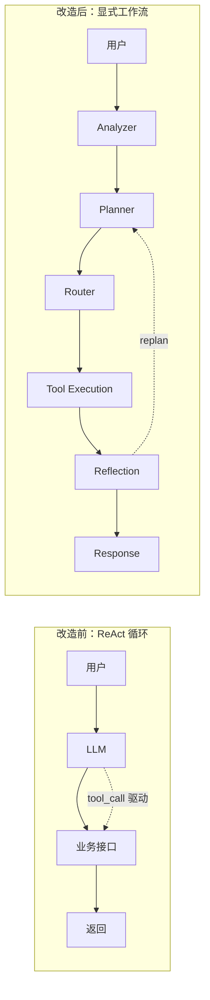
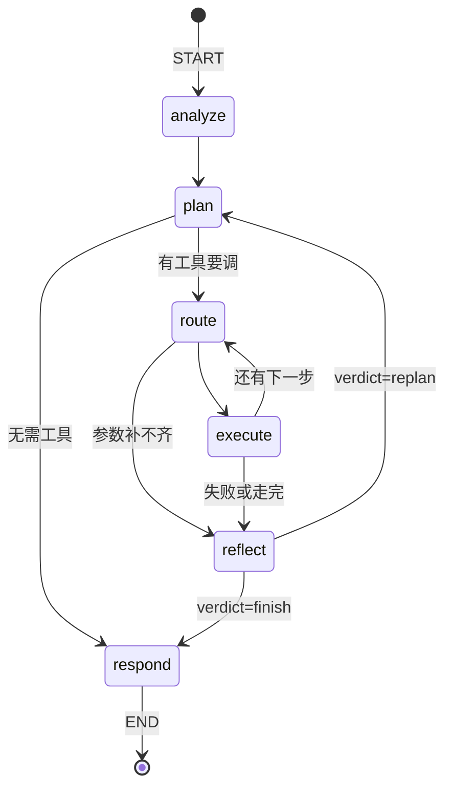

# Agent Workflow 架构说明

> 把实验室预约系统从「LLM + CRUD」改造成一条**显式可控的 Agent 工作流**。
> 本文记录架构决策、契约、以及踩过的坑 —— 尤其是那些「看起来在正常工作、
> 实际上核心能力已经失效」的静默故障。

---

## 1. 为什么要改造

改造前的形态是典型的 `用户 → LLM 理解 → 调后端接口 → 返回结果`：

- **控制流属于 LLM。** 流程走多远、调哪个接口、什么时候结束，全由模型的
  tool_call 决定。模型漏调一次，业务就少做一步，而且没人发现。
- **没有任务分解。** 「先查有没有空、再查权限、最后下单」这种业务顺序没有
  被显式表达，只能指望模型自己记住。
- **没有自我校验。** 模型说「已预约成功」，但数据库里到底有没有这条记录，
  系统从不回查。
- **LLM 直连业务层。** 模型能构造任意参数打到 service，越权风险由模型自觉性承担。

改造后的分工是：**LLM 只负责语言，业务流程由代码负责。**



---

## 2. 目录结构

```
backend/app/
├── agent/                    # Agent 工作流全部逻辑，与业务层隔离
│   ├── graph.py              # LangGraph 编排：节点、条件边、循环上限
│   ├── state.py              # AgentState 契约 + 节点标签 + 循环上限常量
│   ├── planner.py            # LLM 交互层：5 个提示词调用 + 所有确定性兜底
│   ├── tools.py              # 工具注册表：9 个业务能力，唯一的写库入口
│   ├── memory.py             # 短期记忆（对话轮次）+ 长期记忆（用户偏好）
│   ├── tracer.py             # 节点级执行追踪，落 agent_trace 表
│   └── prompts.py            # 5 个提示词集中管理
├── models/
│   ├── agent_trace.py        # 新增表：agent_trace
│   └── user_memory.py        # 新增表：user_memory
├── api/agent.py              # 轨迹 / 工具清单 / 记忆 的只读与管理接口
└── utils/net.py              # 出网 IPv4 强制（见 §9）
```

**分层原则：** `agent/` 只依赖 `services/`，不直接碰 ORM。`services/` 不知道
Agent 的存在。浏览器 → `api/ai.py` → `AgentRuntime` → `agent/graph.py`。

---

## 3. 执行图



| 节点 | 标签 | 职责 | 是否调用 LLM |
|---|---|---|---|
| `analyze` | 理解用户需求 | 解析 slots / missing_slots / authorized（**不产出意图**，见 §7.1） | ✅ 1 次（失败走规则兜底） |
| `plan` | 制定任务计划 | 生成有序工具调用计划，经白名单过滤 | ✅ 1 次（熔断/只读轮走确定性计划） |
| `route` | 选择工具 | 补全当前步参数，决定执行还是跳过 | 仅在参数不全时调用 |
| `execute` | 执行工具 | 调 `run_tool`，结果写入 `tool_results` | ❌ |
| `reflect` | 反思与校验 | 判定 `finish` / `replan`，可触发重规划 | ✅ 1 次（只读轮跳过） |
| `respond` | 生成最终回复 | 流式生成自然语言答复 | ✅ 1 次（不重试，有兜底文案） |

**关键设计：** `reflect` 是必经之路。模型无法绕过它直接结束，也无法跳过
`plan` 的授权闸门直接写库。

**循环上限：** `MAX_PLAN_STEPS=6`、`MAX_REPLAN_ROUNDS=2`、`RECURSION_LIMIT=60`。
最坏情况 3 轮 ×（2 编排 + 6×2 执行）≈ 42，留一倍余量。

**提前止损：** `CRITICAL_TOOLS = {query_lab_availability, check_user_permission,
create_reservation}` —— 这几个失败后，剩余步骤做了也没意义（实验室都查不到，
下单必然失败），直接跳到 `reflect`。

---

## 4. AgentState 契约

```python
class AgentState(TypedDict, total=False):
    # 输入
    user_id: int
    conversation_id: str
    today: str                    # 服务器日期，日期换算的唯一事实来源
    user_query: str
    history: list[dict]           # 短期记忆：最近 MAX_HISTORY_MESSAGES=20 条
    memory_context: str           # 长期记忆：渲染成文本塞进规划提示词

    # analyzer 产出（只有任务状态，没有分类标签）
    slots: dict
    missing_slots: list[str]
    authorized: bool              # 写库闸门，见 §7

    # planner 产出
    plan: list[PlanStep]          # ①
    cursor: int                   # ②
    replan_round: int

    # 执行期
    read_only: bool               # 只读恢复轮，禁止写库
    tool_results: list[dict]
    observations: list[str]
    halt: bool

    # reflector 产出
    reflection: str
    verdict: str                  # finish | replan

    # 输出
    final_response: str
    error: str
```

> ① 规范写作 `task_plan`，② 写作 `current_step`。这里用 `plan` / `cursor` ——
> 见 §10 的偏离说明。

`AgentContext` 是**进程内**的副作用载体（不进 state）：`db` 会话、`user`、
`conversation_id`、SSE `writer`、LLM 调用计数 `counter`、失败计数 `llm_failures`。

---

## 5. 工具层：唯一的写库入口

**硬约束：LLM 不接触数据库。** 所有业务能力必须注册成工具，模型只能提出
「用哪个工具、带什么参数」，由 `run_tool` 统一执行。

```python
@agent_tool(name=..., label=..., description=..., parameters={JSON Schema})
def some_tool(ctx: AgentContext, ...) -> dict: ...
```

注册表值是不可下标的 `AgentTool` 对象（`.handler` / `.label` / `.description`
/ `.parameters`）—— 调用请统一走 `run_tool(ctx, name, args)`。

### 工具清单

| 工具 | 签名 | 定位 |
|---|---|---|
| `search_lab_docs` | `(query)` | 知识库检索（规则、安全规范） |
| `list_open_labs` | `(keywords)` | 开放实验室列表 |
| `list_lab_equipments` | `(lab_name, keywords)` | 某实验室的设备 |
| `query_lab_availability` | `(lab_name, date, start_time, end_time)` | 开放窗口 + 占用时段 + 空闲时段 |
| `check_user_permission` | `(lab_name)` | 账号状态 / 实验室开放 / 配额 |
| `find_available_slots` | `(lab_name, date, duration_hours, preferred_start)` | 替代时段推荐 |
| `create_reservation` | `(lab_name, date, start_time, end_time, equipment_name?, remark?)` | **写库** |
| `verify_reservation` | `(lab_name, date)` | 回查落库与审核状态 |
| `get_today` | `(offset_days?)` | 服务器日期与相对日期 |

### 返回契约

每个工具**必须**返回真实数据，失败时必须给出结构化错误，绝不允许返回编造的
内容：

```jsonc
// 成功
{"ok": true, "reservation_id": 12, "date": "2026-10-09", "status": "待审核", ...}
// 失败
{"ok": false, "error": "该时段已预约"}
```

### 两条容易被忽略的工具设计原则

**① 参数安全：身份只来自 `ctx.user`，不接受模型传 `user_id`。**
`check_user_permission(lab_name)` 而不是 `check_user_permission(user_id, lab_id)`
（规范原样）—— 否则模型可以传任意 `user_id` 查询他人配额，是典型的 IDOR。

**② 空结果要降级，不要如实汇报错误结论。**
模型很爱把问句里的修饰语当检索关键词（实测「现在有哪些实验室开放？」→
`keywords="实验室开放"`）。严格按过滤执行会得到空列表，然后 Agent **如实**
汇报「当前没有任何实验室处于开放状态」—— 把模型的措辞失误放大成了一条与
事实相反的**业务结论**。所以 `list_open_labs` / `list_lab_equipments` 在
关键词零命中时会退回「不带过滤」再查一次，并用 `keyword_matched=false`
明确告知调用方。返回多几行只是不够精准，返回空列表却是在说假话。

---

## 6. 记忆层

| 类型 | 载体 | 生命周期 | 用途 |
|---|---|---|---|
| 短期 | `agent_memory` 表 | 会话内 | 对话上下文，支撑「还是老时间」这类指代 |
| 长期 | `user_memory` 表 | 跨会话 | 用户偏好，注入规划提示词 |

长期记忆由 `learn_from_reservation()` 在**成功的** `create_reservation` 之后写入，
归纳出两类事实：

```
[u2] 经常预约「计算机实验室」
[u2] 习惯预约时段：上午（约 10:00 开始）
```

`load_memory_context()` 把它们渲染成文本塞进 PLAN_PROMPT 的 `{memory}` 槽位。
效果可见于最终回复 —— 时段冲突时 Agent 会说「**考虑到您习惯上午预约**，
也可以告诉我，我可以帮您查看上午是否有其他可用时间」。

另提供 `GET/POST/DELETE /api/agent/memory` 供用户查看与增删。

---

## 7. 授权闸门：`authorized` 语义与一次严重教训

这是整个项目里最值得记录的一段。

### 设计意图

`authorized` 是写库闸门：`_sanitize_plan` 会把 `create_reservation` 从计划中
摘除，当 `authorized=False` 或本轮是 `read_only` 时。目的是**不让 LLM 单方面
写数据库**。

### 实际发生的故障

上线联调时，「帮我预约明天上午 10 点到 12 点的计算机实验室」这条**措辞明确、
三要素齐全**的请求，模型返回了 `authorized=false`。于是：

1. `_sanitize_plan` **静默**摘掉了 `create_reservation`（日志级别仅为 `info`）；
2. 计划退化成 `list_open_labs → check_user_permission → query_lab_availability
   → verify_reservation` —— 一个**只查不写、却还去验证**的自相矛盾计划；
3. `reflect` 发现「验证不到记录」→ 判定 `replan` → 重新规划**又漏掉**这一步；
4. 直到耗尽 `MAX_REPLAN_ROUNDS`，最终回复退化成一句无关的查询结果。

用户明确下了单，系统什么都没做，而日志里没有任何 warning。

### 根因：把两种不同性质的问题混为一谈

| 问题 | 性质 | 谁来判断 |
|---|---|---|
| 「用户有没有**吩咐我们**写库」 | **语言问题** | 规则可判，模型只是辅助 |
| 「这个用户**有没有权限**写库」 | **权限问题** | `check_user_permission` 工具 |

`authorized` 原本被设计成让模型回答**权限问题** —— 但模型没有任何权限知识，
它的答案只是猜测。把这个猜测当作硬安全闸门，等于让一次随机误判禁用核心能力。

### 修复（防御纵深）

1. **确定性识别与模型判断取并集**（`explicit_booking_request()`）：
   判据 = 提到预约动词 **且** 无疑问语气（`吗/呢/怎么/什么/能不能/有没有…`）。
   单独使用会误判「预约需要什么材料？」，所以还必须叠加
   `_slots_ready_for_booking()`（实验室 + 日期 + 起止时间齐全）。
2. **计划生成后由系统补齐写库步骤**（`_ensure_write_step()`）：明确的预约请求
   必须包含 `create_reservation`，若模型遗漏则插入到 `verify_reservation`
   之前（**先写后验，顺序不能反**）。不赌模型记不记得。
3. **摘除升级为 `warning`**：这条日志意味着用户要求的预约很可能不会发生，
   是最需要被看见的一类降级，不能埋在 `info` 里。

`_ensure_write_step` **绝不**补齐的场合：`read_only` 轮 / 未授权 / 槽位不全 /
空计划（空计划说明模型整段没产出，应整份换成兜底计划，
否则会得到一个没有前置校验的裸写库计划）。

### 7.1 为什么没有「意图识别」这一步

`analyze` 刻意**不输出意图**（既不调 LLM 分类，也不做关键字匹配）。

规划器本来就拿得到「用户原话 + 槽位 + 缺失项」——意图标签在里面是冗余的：
与其先猜一个类别、再让规划器按类别选工具（多一次「分类判错、后面全错」的机会），
不如让规划器直接读懂用户想干什么。少一个中间结论，就少一处失真。

`analyze` 留下的三个产出都是**任务状态**而不是分类标签：
用户说了什么（`slots`）、还缺什么（`missing_slots`）、能不能写库（`authorized`）。
前两个是事实，第三个是安全闸门。

对应地，模型不可用时的 `_fallback_plan` 也不按意图分支，只用两个确定性事实选流程：
槽位是否齐全、本轮是否字面上下单。代价是「查制度 / 查设备」这类非预约诉求
在降级时会退化成「先列出开放实验室」—— 这是有意的取舍：宁可给一个真实但宽泛
的答案，也不靠关键字去猜用户想干什么。

### 7.2 孤立的验证步骤必须一并摘除

`_sanitize_plan` 摘掉 `create_reservation` 时，会**同时**摘掉计划里的
`verify_reservation`。原因：没有写库却去验证，`verify_reservation`
查的是「该用户在该实验室该日期的预约记录」，它完全可能查到**上一轮就已存在**的
历史记录；`reflect` 与最终回复会据此宣布「预约已成功创建，reservation_id 为 12」——
一个刚被系统拦下的操作，被讲成了成功。宁可不验证，也不能说假话。

### 另一道闸门：`read_only` 恢复轮

目标时段被占用时，系统**不会**替用户换时间下单 —— 改变诉求必须由用户点头。
该轮只允许查询类工具，由 `find_available_slots` 查出替代时段交给用户挑选。
（「替用户自作主张换时间下单」比「不给结果」更糟。）

---

## 8. LLM 韧性：四层防御

一次完整对话要发起 **4–8 次 LLM 调用**，任何一次卡住都会让整轮失去响应。
实测该服务商的表现方差极大（同一请求 0.3s ~ 153s），因此分层兜底是必需的。

| 层 | 机制 | 取值 |
|---|---|---|
| 1 | 重试 + 慢失败区分 | `RETRY_DELAYS=(0.0, 2.0, 6.0)`，单次超过 `SLOW_FAILURE_SECONDS=8.0` 就不再重试 |
| 2 | 显式超时 | `LLM_TIMEOUT=15.0`，`max_retries=0`（SDK 默认 600s 且会与重试相乘） |
| 3 | 每轮熔断器 | `BREAKER_THRESHOLD=1`，在整次 `_ask` 粒度计数 |
| 4 | 确定性兜底 | 每个 LLM 环节都有规则实现 |

此外：

- **429 ≠ 网络抖动。** 免费额度限流会在 0.05–0.12s 内快速失败并返回
  `您已达到免费用户的 API 速率限制`。把限流当抖动重试只会更快烧掉配额，
  因此 `is_rate_limited()` 单独识别 429，`is_transient()` 对它返回 `False`，
  熔断后本轮其余环节全部改走确定性路径。
- **最后一步不重试。** `respond` 单次尝试 + 首包超时 `LLM_FIRST_TOKEN_TIMEOUT=10.0`，
  失败则用 `_compose_fallback_reply` 按缺失信息拼出兜底文案（已发送部分输出
  则不重试，直接保留）。
- **只读轮走确定性计划**，把健康轮次的调用数从 6 次降到 4 次，省下的额度留给
  真正需要推理的环节。

---

## 9. 出网怪癖：为什么异步流式会报 `Connection error`

**症状：** 同步接口正常，流式接口报一个没有任何上下文的
`openai.APIConnectionError: Connection error.`，堆栈指向
`httpcore2/_async/connection.py` —— 完全看不出和 DNS 有关。

**根因：** 目标域名 `api.agnes-ai.cn` 同时有 A 与 AAAA 记录，而它的 IPv6 入口
在 TLS 阶段被 RST。对策是强制 IPv4，做法是猴子补丁 `socket.getaddrinfo`。
但 **uvloop 有自己的 C 层解析器，根本不经过 `socket.getaddrinfo`** ——
补丁不报错、也不命中，是彻底的静默失效。而同步链路（`httpx.Client` 在普通
线程里调 `socket.getaddrinfo`）一直有效，于是现象变成「同步能通、流式不通」。

**修复：** `utils/net.py` 的 `_patch_uvloop()` 在类级别接管
`uvloop.Loop.getaddrinfo`，由 `prefer_ipv4()` 触发（`LLM_FORCE_IPV4=True`）。

**为什么还要加启动自检：** 这类故障的症状和 DNS 毫无关系，所以
`main.py` 的 `_log_outbound_status()` 在启动时打印事件循环类型、IPv4 白名单
与补丁接管状态；若是 uvloop 且补丁未接管，直接给 warning 并提示改用
`uvicorn --loop asyncio`。

> 备用方案（补丁失效时）：用 `--loop asyncio` 启动。

---

## 10. 有意的规范偏离

| 规范要求 | 实现 | 原因 |
|---|---|---|
| `check_user_permission(user_id, lab_id)` | `check_user_permission(lab_name)` | 防 IDOR：身份只能来自 `ctx.user`，不能让模型传 `user_id` |
| `AgentState.task_plan` / `current_step` | `plan` / `cursor` | 命名对齐实现语义；另新增 `authorized` / `read_only` 等字段 |
| — | 新增 `authorized` 写库闸门 | 不允许 LLM 单方面写数据库（教训见 §7） |
| — | 新增 `read_only` 恢复轮 | 换时间属于改变诉求，必须由用户确认 |
| — | 每个 LLM 环节都有确定性兜底 | 模型不可用时主流程仍需跑通 |
| — | 列表工具空结果降级 | 诚实优先于字面精确（见 §5） |

---

## 11. 追踪与前端面板

`tracer.py` 的 `trace_node` 上下文管理器在每个节点执行时写入 `agent_trace`
（`conversation_id` / `node_name` / `step_index` / `status` / `input` / `output`
/ `execution_time`），前端据此渲染「Agent 执行轨迹」面板。

### SSE 事件契约

| 事件 | 载荷 |
|---|---|
| `session` | `conversation_id` |
| `status` | `message` |
| `node` | `node` / `label` / `status`(start\|end) / `detail` / `state` / `duration_ms` |
| `analysis` | `slots` / `missing_slots` / `authorized` / `detail` |
| `plan` | `round` / `steps[]` |
| `step` | `id` / `tool` / `label` / `status` / `args` \| `detail` \| `result` / `reason` |
| `reflection` | `verdict` / `text` / `round` |
| `token` | `content` |
| `done` | `answer` |
| `error` | `message` |

面板呈现的步骤标签与规范一致：**理解用户需求 → 制定任务计划 → 查询实验室状态
→ 检查权限 → 创建预约 → 验证结果**，冲突场景下额外出现**查找替代空闲时段**，
并附「需求理解 / 任务计划（第 N 轮）/ 反思与校验（第 N 轮）」结构化区块与
长期记忆实时刷新。

---

## 12. 已验证的端到端结果

### 成功路径

请求：`帮我预约明天上午 8 点到 10 点的计算机实验室`

```
9 个节点 · 5 次工具调用 · 7.4s
  理解用户需求        1608.9ms  槽位={'lab_name': '计算机实验室', 'date': ...}；授权=True
  制定任务计划        3700.3ms  list_open_labs → check_user_permission
                                → query_lab_availability → create_reservation
                                → verify_reservation
  查询开放实验室                {"ok": true, "total": 1, "labs": [{"id": 1, ...}]}
  检查权限                      {"ok": true, "allowed": true, "quota": 5}
  查询实验室状态                requested.available = true
  创建预约                      {"ok": true, "reservation_id": 12, ...}
  验证结果                      {"ok": true, "exists": true, "verified": true}
  反思与校验               956ms  判定=finish
  生成最终回复          1109.3ms
```

数据库确认落库：
`id=12, user_id=2, lab_id=1, date='2026-10-09', 08:00-10:00, status=0(待审核)`。
长期记忆新增「习惯预约时段：上午（约 08:00 开始）」。

> 几点值得注意：
> - 计划里 `create_reservation` 紧邻 `verify_reservation` **之前**，先写后验。
> - 全流程 `route` 环节均 0ms —— 计划阶段已把槽位预填进参数，路由无需调用模型。
> - 5 次工具调用全部返回 `ok: true` 的真实数据，写库结果经回查确认。
> - 本轮模型调用共 4 次（analyze / plan / reflect / respond）。

### 冲突路径（体现反思与重规划）

请求：`帮我预约明天下午 2 点到 5 点的计算机实验室，如果没有空闲设备推荐其他时间`

```
第 0 轮  创建预约  failed  {"ok": false, "error": "该时段已预约"}
         反思      replan  原定时段被占用，存在通过调整时间成功的明确路径
第 1 轮  查找替代空闲时段  done  slots: [{"17:00", "20:00"}]
         反思      finish  替代时段已查回，不再走写库操作，转为给出可选项
最终回复  推荐 17:00-20:00，并引用长期记忆「考虑到您习惯上午预约」
```

注意：Agent **没有**擅自换时间下单。

### 健壮性

- 不存在的实体（如「光学实验室」）：工具返回
  `{"ok": false, "error": "没有找到名为「光学实验室」的实验室"}`，
  反思正确判定为**不可恢复的实体错误**（不徒劳重规划），最终回复诚实说明
  并借助长期记忆推荐可行的实验室。
- 噪声关键词：「现在有哪些实验室开放？」正确返回 9 个实验室。
- 限流（429）：整轮**恰好 1 次**模型请求，其余环节走确定性路径。

---

## 13. 如何运行

```bash
# 后端（backend/.env 需配置 DATABASE_URL / JWT_SECRET_KEY / LLM_* ）
cd backend
.venv/bin/python -m uvicorn app.main:app --port 8000
# 若 IPv4 补丁未接管（启动自检会提示），改用：
# .venv/bin/python -m uvicorn app.main:app --port 8000 --loop asyncio

# 前端
cd frontend && npm run dev     # http://localhost:5173/manager/ai-chat
```

相关配置（`app/config.py`）：

| 变量 | 默认 | 说明 |
|---|---|---|
| `LLM_TIMEOUT` | `15.0` | 单次模型调用超时 |
| `LLM_FIRST_TOKEN_TIMEOUT` | `10.0` | 回复首包超时 |
| `LLM_FORCE_IPV4` | `True` | 强制 IPv4，规避 AAAA 故障（§9） |
| `KB_WARMUP_ON_STARTUP` | `True` | 启动预热知识库 |

**建表方式：** 项目没有引入 Alembic 之类的迁移工具，`main.py` 启动时调用
`Base.metadata.create_all(bind=engine)` —— 它会**只创建缺失的表**，
`agent_trace` / `user_memory` 因此在首次启动时自动出现。代价是它**不会**修改
已存在表的结构，后续给现有模型加字段仍需手写 DDL。

**`uvloop` 是可选依赖：** `requirements.txt` 里没有显式声明（由环境自行安装）。
未安装时 uvicorn 使用 asyncio 事件循环，此时 §9 的 `socket.getaddrinfo`
补丁直接生效，`_patch_uvloop()` 静默跳过，行为依旧正确。

启动日志应出现：

```
已为 uvloop 安装 IPv4 优先补丁（否则异步流式请求会走 IPv6 失败）
出网自检：事件循环=Loop，IPv4 强制主机=api.agnes-ai.cn，uvloop 补丁=已接管
```

---

## 14. 已知限制

- **单机单进程。** 熔断器、LLM 调用计数都在 `AgentContext` 里，是多副本部署时
  需要外置到 Redis 的部分。
- **规划质量依赖模型。** 计划由 LLM 生成，系统只能保证「不越权、不越界、
  不漏核心步骤」，无法保证计划最优。
- **长期记忆是简单归纳**（频次统计），没有做衰减、冲突消解或用户可编辑的偏好模型。
- **`route` 环节在参数齐全时 0 次 LLM 调用**，但参数缺失时会逐步骤调用模型，
  极端情况下仍是调用数的主要来源。
